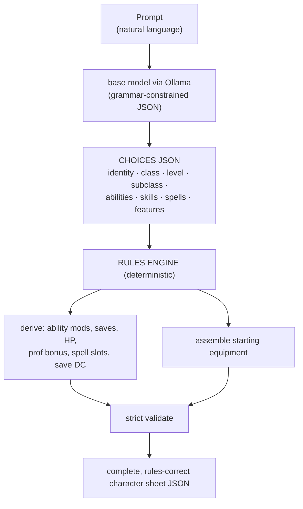

# Arcane Scroll — Project State

> **Master state doc (public, high-level).** One source of truth for what we're building, what
> works, what's decided, and what's next.
>
> Last updated: **2026-07-16**. **Recent:** 5-schema split **Phases A–C complete** — CORE (C0), GRIMOIRE (deriver + validator), INVENTORY (validator), and MODIFIER (derivation engine + orchestrator/validator), plus a DB-audit integrity pass (F05-T38). **Phase D** — the gold-corpus migration to the 5 schemas (F05-T39) — landed with its 215 tooling fixes (multi-schema harness **308 → 87**; the remaining 87 carded as errata / DB-gaps / effect-materialization expansion). Effect-materialization expansion (F05-T44) now complete: intrinsic permanent-defence advantages (part a) and state-gated resistances/size/damage-rider materialization (part b). **Phase E** (COMPANION) + monster-sheet + self-transform materialization landed (F05-T40/T59/T60). **F05-S13 — generator adoption on the DAL — structurally complete** (T66–T71 + parity T82/T83): the generator emits the 5-schema document, the 2014 stack is retired, 0 xfails; a generator-completeness tail (T89–T95 et al.) remains carded. **804 tests.**

---

## 1. Executive summary (read this first)

**The core architecture decision.** The AI system lives in its **own repo/service** (Python),
separate from the web app (`arcane-desk`, SvelteKit), talking over a small versioned HTTP API.
Different runtimes, different hardware needs (this service is pinned to the GPU box), different
iteration speed — keeping them apart keeps both clean. The JSON schema is the contract.

**How generation works (the one principle that drives everything):**
> **The model makes the *choices*; deterministic code does the *math* — and validity is
> *engineered*, not hoped for.**
The model picks the thematic choices (background, alignment, skills, spell names, subclass when
unspecified, fighting style, expertise, and every subclass/class feature choice) plus the flavour
bundle. Code injects the deterministic fields (race, class, level, ability assignment, resolved
subclass) and — crucially — a **per-request dynamic grammar** constrains the model's picks to the
*valid* options at the *exact* counts. An engine de-dup/pad step fixes the one thing a grammar
can't (uniqueness). Result: **valid by construction**, with no reliance on the model knowing the
rules.

**The model approach changed (and got simpler — see §4).** We **dropped the fine-tune**. A **base
compact model (`qwen3:4b-instruct-2507`, q4_K_M) + dynamic grammar + engine de-dup** scores
**149/149 valid** on the held-out eval (single + multiclass, all levels) — beating the fine-tune's
ceiling *and* removing the two-model problem. **One** base model does both the sheet
(constrained JSON) and the flavour (plain prompt), fully GPU-resident (~2.5 GB).

**Where we are.** The generation half is essentially done and validated:
- ✅ **Sheet choices** — base model + dynamic grammar → **100% valid** over 149. Rich "taste"
  prompt locked: iconic, concept-fit picks at ~0 ms cost.
- ✅ **Class feature choices** — subclass (code-resolved, user-overridable), fighting style,
  expertise, and the **full spread of subclass/class feature options**, via a base + expanded
  **choice contract**.
- ✅ **Feats / advancement** — slots from class+level (multiclass-aware): the model picks feats,
  and code reserves an ability bump where one is due (by priority, capped correctly). Plus
  race-level choices.
- ✅ **Starting equipment** — per-class option slots → a route choice + a concrete-item pick.
- ✅ **Flavour bundle** — one structured call: bounded physical traits, personality, and a
  ~150-word backstory, with empty-field **archetypes** to break narrative monoculture. ~9–11 s/char.
- ✅ Strict **validator** + reference data; the rules layer is the shared source of truth.

**Generation (everything the model chooses) is now essentially complete and valid by construction.
What's left is derivation-side + the service:**
1. The **derivation engine** (the "code does the math" half) — ability mods + **final scores**,
   saves, HP, proficiency bonus, spell slots/DC/attack, AC, initiative, passive perception;
   **auto-granted subclass spells/features**; **languages & tool proficiencies**; **fixed-equipment
   packages**; assemble the chosen equipment into a concrete inventory; strict validator as the
   final gate.
2. Wrap it in a **FastAPI service** and wire **Arcane Desk**.

### Status at a glance

| Area | Status |
|---|---|
| Home-server platform (Docker/GPU/Ollama/Qdrant/NPM) | ✅ running |
| Model approach | ✅ **base `qwen3:4b` + dynamic grammar** (fine-tune dropped) |
| Output contract | ✅ per-request dynamic grammar |
| Sheet choices (incl. multiclass) | ✅ 100% valid (149/149) |
| Class feature choices (subclass/style/expertise/oddities) | ✅ done |
| Feats / advancement + race choices | ✅ done |
| Starting equipment choices | ✅ done |
| Flavour bundle (physical/traits/backstory) | ✅ done (one structured call) |
| Strict validator + reference data (by-construction, generator-side) | ✅ working |
| **Reference rulebook DB (`rules.db`) + data-access layer (`access/`)** | ✅ **landed (F05-S01)** — relational DB read via a read-only handle + retrieval primitives + a name→id resolver + per-domain feature-access query modules |
| **Validation micro-service (independent post-hoc gate)** | ✅ **rebuilt on `access/`** (F05-S12) — resilient orchestrator + typed report + **15 registered domain checks**. Per-sub-schema validators live: **CORE** (`/validate-core`, 12 checks), **GRIMOIRE** (`/validate-grimoire`, 15 violation types), **INVENTORY** (`/validate-inventory`, 7 types), **MODIFIER** (`/validate-modifier`, 16 checks), **COMPANION** (`/validate-companion` — concrete + scaling creatures). All five sub-schemas now have live validators. |
| **5-schema derivation (CORE → GRIMOIRE → MODIFIER)** | ✅ GRIMOIRE deriver (T33) + MODIFIER derivation engine (T36, 17 functions) + orchestrator (T37, 3 modes, 17 non-overwritable player/DM paths, same-source dedup) |
| **Generation (all model choices)** | ✅ **complete & valid by construction** |
| **Service stack (Docker: model + app)** | ✅ scaffolded — skeleton serving |
| **Shared resource catalog (load-time)** | ✅ loaded in memory at startup |
| **Character sheet generator** | ✅ base contract + feature/feat/equipment choices |
| **Backstory generator** | ✅ physical + personality + backstory |
| **HTTP API** (`POST /v1/characters`, `/v1/backstory`) | ✅ live — `/v1/characters` now returns choices **+ derived sheet** |
| **Test suite** (per-layer, synthetic fixtures) | ✅ **631 tests collected** — generator + data-access (`access/`) + the four sub-schema validators (CORE/GRIMOIRE/INVENTORY/MODIFIER) + MODIFIER derivation; xfail = generator-conformance gaps (fixed last, never by bending the validator) |
| **Derivation engine (compute side)** | ✅ render-ready sheet + armour-based AC + inventory assembly + **starting treasure**; two-pass next (T42/T46) |
| Arcane Desk integration | ⬜ later |
| Off-disk backup | ⬜ TODO |

### Changelog (newest first)

- **CORE deriver completeness + gold reconciliation (F05-T74 / T76 / T77 + two cap findings, branch `feat/f05-tail-closeout`).** Closed the CORE-deriver tail against the deriver-correct model. **T74** — the CORE deriver now emits `resource_budgets` from the class-resource ladder (each class/subclass resource with a whole-number COUNT ladder contributes its maximum at the build's level; dice/bonus/formula uses out of scope), via a new access reader (`access/validator/resources.py`) and a new independent CORE check (`validator/checks/resources.py`, registered in CORE_CHECKS) that re-derives the ladder maximum and flags a declared budget whose max disagrees — scoped to the ladder, never weakened. GRIMOIRE consumes the emitted field through its existing name-keyed fallback reader. **T76** — DECISION: EMIT `identity.classes[].class_detail` (and `subclass_detail`) as a display pass-through from choices (contract already allows it; a per-class detail choice the GRIMOIRE deriver consumes for spell-list widening); resolved via the `detail_option` name dimension. **Ability-cap ceiling re-derivation** — the over-cap check no longer uses a flat 20: it re-derives each ability's ceiling from the grant spine (base cap, raised by a class's level-20 capstone for its two boosted abilities, raised by an Epic-Boon feat for the boosted ability). Reference DB gained 2 class-owned level-20 capstone `grant_ability_increase` rows (two abilities → max 25) so the check reads the raised cap independently (FK-clean rebuild). This clears a level-20 martial build's legitimate 24/22 scores; a genuine level-18 over-cap (dex 21 with no cap-raising source) was root-caused as gold errata — the deriver clamps to the standard cap — and fixed. **T77** — gold corpus bumped **v17 → v18** (v17 intact; transform `gold-v18/migrate_v18.py`): 72 stale (pre-2024) class-resource ladder maxima reset to DB values with MODIFIER `resource_state` mirrored on 64 sheets, 27 sheets' bare armour display normalised to the canonical "X armor" form, and the one dex erratum fixed; the background tool "gap" was confirmed a player category-choice (a background grants a tool *category*, not a fixed tool — no DB change). Repo suite 844 passed / 0 xfailed; gold-v18 harness green on core/inventory/grimoire/modifier/companion/monster, only the single intentional incompatible-states negative remaining. Carded follow-ups: model class-detail-sourced proficiency grants in the CORE deriver (a class detail choice granting heavier-armour + broader-weapon proficiency) then reconcile the residual weapon-tier/tool gold items; extend `resource_budgets` to non-ladder resources and normalise gold budget keys.

- **Generator adoption on the DAL — S13 structurally complete (F05-T66–T71, + parity T82/T83).** The "fix the generator last" milestone: the character generator now runs entirely on the data-access layer and emits the 5-schema document, replacing the retired 2014 flat-file/monolithic-contract stack. **T66** — `access/generator/` pure-read package (the choice-space over `rules.db`). **T67 (keystone)** — `app/derivation/core.py::derive_core`: a DAL-grounded CORE deriver on the current model (species with no ability bonus; ability increases + origin feat from the background; ability cap; lowercase weapon-proficiency canonicalisation), with its OWN senses/speed resolution so `/validate-core` is a genuine independent check; reproduces all 218 hand-migrated gold CORE sheets legal+complete. **T68** — `app/derivation/document.py`: the pipeline (choices → derive_core → inventory assembly + class-gated grimoire + modifier + companion → full 5-schema document); reconciled the always-on ability-set owner-set (debt b). **T69** — the choice grammar migrated off the flat-file catalog onto the DAL + the species/background model (`app/generation/choices/`). **T82/T83 (parity)** — chosen spells consumed into GRIMOIRE (DB-count-capped), and the ASI/feat-slot progression wired in (repeatable raw-ASI supported). **T70** — the generation endpoint cut over to the new pipeline; the 8 deprecated-contract xfails replaced by 5-schema conformance tests (0 xfails tree-wide); the old stack retired (−2849 lines). **T71** — the new-DAL test vocabulary neutralised (F02-HYGIENE, new-DAL portion). Every phase reviewed by code-review + harness. 804 tests + 0 xfailed; gold harness unchanged throughout (the generator is decoupled from the static gold corpus). **Remaining generator-completeness tail (carded, non-blocking):** multiclass-prereq gating (T89), backstory de-race + old-catalog retirement (T90), monolithic-schema retirement (T91), equipment item-stacking (T92), subclass free-cantrip budget (T93), weapon-mastery choice (T94), validator "spell scroll" vocabulary (T95); plus the earlier T74–T88 refinements. These make a *generated* character valid across all builds; the pipeline + validators are complete.

- **Monster materialization + self-transform (F05-T59 / T60).** The two non-companion halves of the creature system, built on the companion foundation. **T59 (standalone monster sheet, `6f8143f`):** a new `monster-sheet:1` contract (`monsters[]`, each `{creature_id, stat_block}` where the stat block `$ref`s the companion-modifier shape verbatim) + an owner-less deriver reusing the concrete companion path + an independent `/validate-monster` check that rejects templated (owner-scaled) creatures; a monster materializes as its own sheet. **T60 (self-transform, `e7cffe9`):** the MODIFIER `detail.into` path went from size-only to full effective-stat replacement — the character temporarily *becomes* the creature. Two kinds via `detail.transform`: `physical` (form replaces STR/DEX/CON + AC/speed/senses/attacks/size; retains INT/WIS/CHA, own proficiencies/PB, own HP) and `full` (all six abilities the form's; saves/skills the form's ability mods, no proficiency). Under an active transform the MODIFIER⊇CORE subset checks are suspended (the form's block is authoritative) — precisely gated so the 218 normal sheets keep full validation; the validator independently re-derives the form block (incl. attacks) from the catalogue and enforces the retained-vs-replaced split. Reviewed by code-review + harness (suspension verified not to weaken normal sheets; transformed values recomputed correct against the catalogue). Gold: monster 2/2, states 17/17 complete (new `wild-shaped`, `polymorphed` migrated to `full`); 853 tests + 8 xfailed. Deferred: creature-legality gate (T61), controlled-creature link expansion (T62), creature save proficiencies (T63), reuse-seam hardening (T64), transform fidelity refinements (T65), arbitrary-monster breadth (T27).

- **COMPANION subsystem — Phase E complete (F05-T40).** The 5th sub-schema now has a full materialization + validation pipeline, built on the existing creature stat-block data (63 creatures + a templated-formula scaling engine already in the reference DB). **P0** (`9f64874`): a `grant_companion` owner→creature link table (reference-DB L21 topper, 23 verified links — bound familiars, summoned-spirit blocks, beast-companion subclass creatures; self-transform forms deliberately excluded) + a pure creature access module. **P1+P3** (`17a847d`): a concrete-creature deriver (abilities/AC/HP/hit-dice/speed/senses/skills/saves/defenses/passive/attacks from the catalogue) + orchestrator, an independent DB-grounded COMPANION validator (fires *illegal* on a value mismatch and *incomplete* on a catalogued-field omission), a `/validate-companion` endpoint, and the harness companion loop cut over from its `validate_modifier` placeholder. **P2** (`be3180b`): a spec-driven creature-formula scaling engine — evaluates `creature_formula`/`_term` against owner context (class level, PB, spellcasting-ability mod, spell attack mod, spell save DC from CORE+GRIMOIRE) and the summon cast level, with floor rounding, above-level thresholds, data-driven form gating, and multiattack/aura-save-DC scoping; the validator independently re-derives every scaled target. Contracts gained backward-compatible optional fields (`CORE.companions[].cast_level`/`form`; `companionModifier.multiattack`/`attacks[].save_dc`). Reviewed by code-review + harness across every phase (independence verified, scaled values checked arithmetically against the reference formulas + source). Gold corpus **companion 6/6 legal & complete** (3 concrete + 3 templated); 804 tests + 8 xfailed. Split-out follow-ups carded: standalone monster sheets (T59), self-transform stat replacement (T60), creature-legality gate (T61), controlled-creature link expansion (T62), creature save proficiencies (T63); arbitrary-monster breadth stays with T27.

- **Content hygiene: access-layer proper-noun scrub + warning-item render text (F05-T46 / T49).** T46 (repo, `07b7e9d`): neutralized game proper nouns in 12 docstring/comment sites across `access/` + `validator/` — text-only, zero logic; proper-noun grep clean (only the "resilient orchestrator" architecture term remains). T49 (data bundle): reworded a render-only warning-item `scope_note` to current phrasing (mechanic row unchanged, no consumers, no harness impact). Housekeeping — no behaviour change.

- **MODIFIER effective-CON HP + item extra-damage rider + shrink-floor note (F05-T50 / T51 / T53).** A coupled MODIFIER bundle (one commit — interleaved shared functions/tests). **(1) T50 — effective-CON max-HP:** the deriver now recomputes maximum HP from the *effective* constitution modifier (which an attuned ability-setting item can raise), expressed as a delta on the existing `max_boost`/`max_reduction` fields — `(eff_con_mod − core_con_mod) × total_level`, added on top of any active-state HP grant — so no contract change. A new independent `_check_hp` re-derives it from CORE + DB grants (exact — it flags a wrong boost/reduction in either direction). **(2) T51 — item-owned extra-damage rider:** an equipped item's single, condition-ungated `extra_damage` grant die now folds into *that item's own* attack (gated by attunement/equip), never onto another weapon; `_check_attack_damage` re-derives it per-attack from the DB. A new `requires_attunement` access helper replaces hand-written SQL across the consumers. Deferred pieces carded: attacks for stats-less magic weapons (F05-T56) and multi-row grant disambiguation (F05-T57). **(3) T53 — shrink rider:** documented that the subtractive damage term is emitted raw and the "not below 1" floor is a roll-time clamp, not encodable in the static damage string; no behaviour change. Also: a hand-authored max-HP-reduction state fixture was found un-backed by any rule and neutralized (versioned v16→v17 migration); the genuine drain/curse reduction mechanism is carded (F05-T58). MODIFIER domain now **16 checks**. Reviewed clean by code-review + harness (two passes each); gold corpus **v16 → v17** (exactly 7 modifier sheets changed + the migrated fixture); 710 passed + 8 xfailed.

- **Corpus byte-reproducibility (F05-T52).** Made a from-scratch regen of the corpus **byte-identical** run-to-run *and across processes* — previously the sheets came out semantically identical but not byte-stable because of non-deterministic ordering, so a regenerated corpus couldn't be diffed without spurious churn. Five order-only fixes, no derived value changed: **(1)** the five set-derived defence arrays in the MODIFIER deriver (resistances, immunities, vulnerabilities, condition-immunities, save-advantages) are now `sorted()` at the union site, so they emit in a stable alphabetical order instead of arbitrary set-iteration order; **(2)** the fill-mode deep-merge dropped its `set()` key union for an insertion-order-preserving one (base's keys in order, then existing-only keys), fixing top-level and all nested key order; **(3)** the grant-spine header retrieval primitive now appends an explicit `ORDER BY id` (every header table's primary key), so grant row order — and the downstream bonus/attack arrays it feeds — is stable across DB rebuilds; **(4)** the speed resolver iterated a raw `equals_walk` mode set to build the speed-dict key order — a hash-seed-dependent (cross-process) order affecting any owner granting ≥2 walk-equal modes (climb+swim) — now iterated `sorted()`; the resolver is shared by the MODIFIER deriver and the validator movement check, so one fix covers both; **(5)** the child value-table reads (`children_of` and the fixed-spell reader) now `ORDER BY` a stable key — child tables have no single `id` PK, so `children_of` orders by every column (its all-column composite key), the fixed-spell reader by `spell_id` — closing the last rebuild-order gap. A committed determinism guardrail asserts the defence arrays are sorted, the deep-merge preserves base key order, the multi-mode speed key order is stable, and — the load-bearing check — the derived output is **byte-identical across subprocesses run under differing `PYTHONHASHSEED` values** (a same-process regen shares a seed and structurally cannot catch this class). Gold corpus bumped **v15 → v16** (versioned regen off the rebuilt DB, which came out byte-identical to before — the fixes are consumer-side): regenerating the corpus from scratch under `PYTHONHASHSEED` 0 vs 42 diffs to **zero bytes** against each other AND against the committed v16 across all 218 CORE + 218 MODIFIER + 16 state sheets, and an order-insensitive comparison v15↔v16 shows **zero value drift** (the one-time byte churn is the expected reorder). DB rebuilt via `build_all.py` (FK-clean). Harness: CORE/MODIFIER 218/218 legal & complete, states 16/16 complete with the sole remaining violation the one intentional incompatible-states negative. 697 passed + 8 xfailed.

- **State-effect materialization expansion (F05-T44b).** Completed the state-driven half of effect materialization on the reference DB's reproducible build path. **(1) State-gated resistances:** a class-feature-owned resistance triple, marked with a `condition_kind` gate, materialises into MODIFIER effective defences only while the owning state is active — class-feature ownership keeps it out of the CORE permanent-defences gatherer (which walks species/lineage/class/subclass/feat, never class features), and the marker is the explicit "only while active" gate. **(2) Size materialization** ships two paths: a new `grant_size` table applies a RELATIVE step over the size ordinal ladder (clamped to the catalogue range), and a set-from-creature transformation reads the target creature's own size at derive-time; a set wins over a step, largest set wins on conflict. **(3) Grow/shrink damage rider:** the size-changing effect also modifies weapon/unarmed attack damage via `extra_damage` grant rows on the existing bonus spine (dice-only), condition-gated per state (+1d4 for the grow variant / −1d4 for the shrink variant, the latter a negative die-count) — this makes the `condition_kind` gate FUNCTIONAL (previously render-only), folded into each attack's damage string with no cross-leak between the opposite riders. **(4) Deriver reconciliation:** state-owned save-advantages now emit the CORE abbreviation (was the raw ability id), so the effective-defences union matches CORE. **Validator:** the defences subset check was extended to save-advantages and condition-advantages, and three new independently-DB-grounded MODIFIER checks were added (state-gated resistances, effective size, attack-damage rider) — bringing the MODIFIER domain to 15 checks. New pure access-layer readers: a size-domain module (grants, ordinal↔id, creature size) and state-gated resistance / extra-damage grant queries. DB rebuilt end-to-end via `build_all.py` (FK-clean); the L20 topper adds the rows LAST so they survive the L6/L8 rebuild. Gold corpus bumped **v14 → v15** (regenerated from scratch off the rebuilt DB; base sheets semantically unchanged, one new shrink state sheet added). Harness: MODIFIER/CORE 218/218 legal & complete, state sheets 16/16 complete with the sole remaining violation the one intentional incompatible-states negative. 690 tests + full suite green.

- **MODIFIER effective-ability + weapon-attack fixes (T47 + T48).** Two coupled derivation/validation fixes landed together with a single gold-corpus bump. **T47 (item set-ability materialization):** the attuned-item branch of the derivation engine now accumulates `grant_ability_set` grants (previously only active-state and item bonuses/senses/speeds materialized), so an attuned item's ability-set grant reaches effective abilities. Semantics locked: a `set` grant is a **true override** of the score; a `floor` grant raises it to a minimum (max). The effective-ability check was tightened from a lenient floor (`effective >= base`) to an **exact** expectation, re-deriving the value independently from the base minus reduction plus any set/floor grants — and made symmetric across owner kinds (attuned items **plus** species/feats/each class/each subclass, level-gated like the saving-throws check). **T48 (weapon-attack proficiency bonus):** the attack deriver added no proficiency bonus because CORE stores weapon proficiency as the tier form ('<tier> weapons') or as a specific-weapon entry, never the bare tier id; matching now succeeds when **either** the wielded weapon's tier **or** a specific-weapon grant is present (case- and singular/plural-insensitive), so the bonus lands. A new **independent attack-bonus check** re-derives each attack (ability-mod choice by finesse/ranged/melee, proficiency bonus when proficient, attuned-item attack bonuses) and flags divergence. New pure access-layer helpers: weapon attack facts (tier/range/finesse), a magic-item weapon-attack bonus reader, and a general ability-set grant reader (owner + level-gated). Gold corpus bumped **v13 → v14** (values only: attacks now proficiency-inclusive; the two ability-set-item sheets now show the item-set ability score and its save). Harness: MODIFIER 218/218 legal & complete; the sole remaining violation is the one intentional incompatible-states negative.

- **Phase D — gold-corpus migration + tooling fixes (F05-T39).** Migrated the 218-sheet gold corpus (168 full + 50 item-heavy) from the monolithic v10 shape into the five sub-schemas — a `gold-v12/` corpus with a multi-schema harness, migration script, and 15 live-state test sheets. The migration surfaced 308 semantic findings; the **215 tooling defects** (slot-vocabulary mapping, GRIMOIRE recovery/dynamic-uses, MODIFIER item-effect materialization, save-modifier + weapon-mastery validators) are fixed, taking the harness to **87**. The remaining 87 are tracked follow-ups — gold errata (F05-T41), reference-DB save-grant gaps (F05-T42), ability-key normalization (F05-T43), and the effect-materialization expansion (F05-T44).

- **DB audit integrity pass (F05-T38).** A data-integrity sweep over the reference DB corrected condition-gating on grant rows (`condition_kind`), level-gating (`gained_at_level`) inconsistencies, and initiative handling — clearing blockers for the 5-schema validators. PR #79.

- **MODIFIER orchestrator + validator — Phase C complete (F05-T37, PR #78).** A 3-mode orchestrator drives the C-M1 derivation engine (mode A: fill from scratch, mode B: fill gaps with path-aware deep-merge protecting 17 non-overwritable field paths, mode C: skip) and applies source-name dedup on spell-granted bonuses (same-spell → highest wins). The companion validator adds 12 checks: AC math, save/skill modifiers, effective abilities (max-not-sum), defense subset enforcement, passive scores, feature/feat presence, prepared spell integrity, and state compatibility (14-row DB table with transitive closure). The adapter passes CORE/INVENTORY/GRIMOIRE/MODIFIER as separate top-level keys rather than merging schemas. New /validate-modifier endpoint. 33 tests + full suite green + gold harness pass. Closes Phase C of the 5-schema split — all 5 deriver/validator tasks (GRIMOIRE deriver+validator, INVENTORY validator, MODIFIER derivation engine+orchestrator+validator) now landed.

- **MODIFIER derivation engine (F05-T36).** A 17-function pure derivation module (`app/derivation/modifier.py`) computes MODIFIER's derived fields from CORE, INVENTORY, GRIMOIRE, character_states, and item_states. Covers ActiveEffects resolution (state→grant lookup across character and item states), abilities (with set-item overrides), AC (armor/unarmored/shield/bonus/floor, driven by armor/ac_formula tables), speed (reuses _resolve_speeds from validator), defenses (resistances/immunities/vulnerabilities/condition-immunities/save-advantages), size, saving throws, skills, passive scores, initiative, HP effects, resource state, prepared spells, attacks (melee/ranged/finesse/versatile/dual-wielding with proficiency gating and weapon mastery), senses, features, and feats. C4 (default state→CORE baseline) is embedded as the first branch in every helper. 6 test DB tables expanded. 34 derivation tests + full suite green + gold harness pass. PR #77.

- **INVENTORY sub-schema validator (F05-T35).** A validator for the independently versioned INVENTORY sub-schema (equipped slots + backpack, pure catalog references). **7 violation types** with a DB-driven slot vocabulary (queries the `item_slot` dimension at runtime, never hardcoded), two-handed/shield conflict resolution via the weapon-property map, and template gating (a template's `base_kind` must match the resolved catalog item's kind). Adapter takes MODIFIER as an optional third input. 22 tests. PR #76.

- **GRIMOIRE sub-schema validator + deriver fix (F05-T34).** A new validator check module for the independently versioned GRIMOIRE sub-schema adds 16 violation types (11 ported from spellcasting, 5 grimoire-specific) spanning DC/attack math, source budgets, spell counts, slot/pact slot validation, spell list membership with generalized list-widening (subclass, class_detail, class_option), class_list legitimacy, recovery validity, ritual tag matching, and secondary cast metadata. The list_widening_classes access function was generalized from hardcoded class to accept any owner_kind; subclass/class_detail/class_option widening was added in both the existing spellcasting check and the new grimoire check. A one-line deriver fix preserves class_list-bucket spells on re-derivation. 38 tests across validator, deriver, and access layers. PR #75.

- **5-schema contract split + Phase B + L19 effect mining (F05-T29/T30/T31).** **Phase A**: 5 independently versioned schemas (PR #70). **CORE validator (C0)**: 12-domain check. **Phase B partial (T30)**: condition_effect, item_slot, state_compatibility, MA grants, pact_slot. **L19 effect mining (T31)**: spell_effect_* (6 tables, 78 rows), d20_modifier (2 rows), grant_bonus.source_name + 156 backfill, power_effect_* expansion (8 rows). Verified by 8 sub-agents in parallel. 474 passed + 8 xfail.

- **Validator rebuilt on the data-access layer (F05-S12, part 1).** The retired flat-file validator is being rebuilt over `rules.db` through `access/`. Landed: a read-only DB handle + retrieval **primitives** over the uniform *grant spine*, a display-name→id **resolver**, and per-domain **feature-access** query modules; a **resilient orchestrator** that runs every check and aggregates all findings in one pass (a crashed check becomes an `internal` finding that blocks both `legal` and `complete` — never a silent pass); a typed **finding/report** model (`{domain, code, kind∈{illegal,incomplete,internal}, message, path}` → `{legal, complete, violations[], summary}`); and **7 domain checks** — identity, abilities, saving-throws, vitals, feats, proficiencies, spellcasting — each grounded independently in the DB (spellcasting reconciled to the v6 sources/spells shape). Validated by migrating the 168-sheet gold corpus to v6 and running it through the rebuilt validator: every finding was book-checked and triaged into *validator bug* / reference-DB *data gap* / genuine *gold errata*, surfacing and fixing real reference-DB gaps (missing subclass proficiency & saving-throw grants, missing subclass/feat/class sense grants, and a temporary activated choose-one ability modelled as an option scaffold). Validator-side fixes from that pass: level-gated subclass grants, multiclass/feat/subclass skill & save credit, expertise budget across classes, third-caster subclass spell lists, and origin-feat budgeting from the background. Built spec-first with synthetic, content-neutral fixtures. Remaining domains (features, movement, defenses, equipment, items, companions) follow in part 2.

- **Contract-first shared schema + grounded validator layers (F02, ongoing).** Made the sheet a **contract-first** shared JSON Schema (`contracts/character-sheet.schema.json`, versioned by a `schema_version` const + a URN `$id`) and grew it **v1 → v5** through repeated **independent multi-agent audits** against the reference: **v2** completed the contract; **v3** added round-1 gaps; **v4** added *defenses*, an *equipment redesign* (`equipped` + `backpack` over a self-describing item contract), a batch of **live-play** fields (spell/hit-dice **pools** `{max, remaining}`, `armor_class_detail`, `companions`, per-feature/feat/item **uses & charges**, `active_concentration`/`active_effects`, temporary HP/ability reductions), and generalised spellcasting to **sources** (class/feat/species/item; slots optional for slotless casters); **v5** added **`speed_detail`**. AC and speed carry **provenance** (base + sourced modifiers) so both re-derive and trace to source; the sheet is a **live play document** and **identifiers suffice** (no rules prose embedded). On the validator: added **feats** (S07), **features** (S10), **movement / identity (size + creature-type) / weapon-mastery** (S12–S15), **skill-source** (S16) and **declared spell-budget** (S17) layers, and reconciled spellcasting to the pool + sources shape (F02-VAL) — **10 layers** total. Throughout, the guiding rule: the validator is built to the correct rules **independently**; the generator's non-conformance is the *intended, measured* gap (fixed later, never by bending the validator/contract), and generator-conformance tests stay `xfail`. Each change landed spec-first with synthetic, content-neutral fixtures (**116** validator tests) and a per-PR **independent multi-agent review**.

- **Independent validation micro-service (F02)** — a second, *post-hoc* validator that lives beside the generator in its own package (`validator/`) with its own FastAPI app, entrypoint, and read-only rules-data mount — distinct from the generator's *by-construction* grammar. `POST /validate` takes a finished sheet and returns one organised report `{legal, complete, violations[], summary}` — violations sorted by `(layer, code)`, each tagged ERROR/WARNING. A **resilient orchestrator** runs *every* check and aggregates *all* findings in one pass; a check that raises becomes an `internal` finding and never aborts the run. Five layers so far: **class/level** (proficiency bonus, subclass-unlock timing), **ability scores** (cap, background-granted increases + their placement pattern), **proficiencies** (saves from the first class, skill count/on-list, background skills), **spellcasting** (unified prepared model, real-spell membership), **vitals** (HP range, hit-dice pool, initiative, passive perception). Rules are **functional facts** loaded from a data dir, built offline by `build_rules.py` from a source extraction (facts only, never prose) — the repo stays content-neutral and the ruleset is *data*, not code. Built spec-first/TDD with synthetic, content-neutral fixtures (31 tests). Containerised as its own compose service. **Why it exists:** an independent gate that catches drift between what the generator was originally built to and the ruleset we now target — something the by-construction grammar cannot check itself.
- **Smart ASI allocation (T48)** — `ability_scores` no longer dumps a flat +2 on one ability. It counts the available ASI points (2 per ASI slot; a slot spent on a real feat yields none) and places them to maximise modifiers (a point only buys a modifier when it takes an odd score to even): the primary ability is raised toward 20 through odd steps but never left stranded on a no-modifier odd, then remaining points even out the highest-priority odd abilities. The ability a model *names* on an ASI pick is now ignored (placement is optimal; the original split-ASI grammar change is unnecessary). Live: primaries land even/at-20 (Str 16→18, etc.), no wasted odd→odd jumps. +3 tests (175); a lone leftover ASI point is spent in full on the highest-priority ability (ASIs come in pairs).
- **Review cleanups (T51)** — F2: `_repair_invocations` takes its count from the granted level (`_invocations_n`), not the model's current list length (removes order-coupling). S1: `sheet.generate` threads the already-computed `ability_assignment` into `helpers.repair` (no recompute). PRF-3: `proficiencies` normalises `tools` to names. VIT-1: documented the `classes[0]`=level-1 convention in `max_hp`. **equipped_armour** now matches by *exact item name against the assembled inventory* — retiring the substring / name-subset / shield word-boundary heuristics (and `_carried_text`); the engine assembles the inventory once and AC reads it. GEN-4 (bare-dict response typing) deferred (low ROI). Net −2 tests (172).
- **Catalog-driven unarmoured defence (T49)** — `vitals.armor_class` reads an `unarmoured_defence` table (`{barbarian: con, monk: wis}`) instead of hard-coded class-name strings, so a renamed/localised class index no longer silently disables it. Behaviour unchanged (Barbarian +CON, Monk +WIS); `armor_class` now takes `cat`.
- **Style↔weapon coherence on every slot + shield rule (T55)** — extended the equipment-grammar style filter from the fighter/paladin union slot to **every weapon-bearing route**, including concrete enum slots (rogue/barbarian) and styles granted by a *secondary* class. Routes whose weapons carry an excluded property are dropped, category-pick enums are filtered, and weapon counts are gated by max (all routes) / min (union picks only — a per-slot single-weapon route isn't dropped); all with a no-empty fallback. Added an **always-on rule**: a route granting a shield never offers a two-handed weapon (kills greatsword+shield). Melee styles now also exclude ranged. Live: rogue/ranger TWF → two melee (was Rapier+Shortbow); shield route 0 two-handed leaks; Defense left weapon-agnostic. +3 tests (174).
- **Code-side variety spread (T57; closes T45, T53)** — background and fighting style are now pre-picked in code (seeded random) and injected as **fixed fields**, instead of model choices that monopolised (Soldier/Acolyte, Dueling/Two-Weapon). Precedence: explicit request input (and the future decoder, T58) → random spread → fallback. The model can't pick or override them. Live: fighters now spread ~7 backgrounds / all 5 styles over 12 (was ~1-3 / one dominant style). Follows the T56 spike finding (variety in code, coherence in prompt). +4 tests (171).
- **Per-class prepared/known spell tagging (T50)** — `spellbook` tagged every leveled spell with a single character-wide prepared flag, so a prepared+known multiclass mislabelled the known caster's spells (and vice-versa). A leveled spell is now prepared iff it sits on one of the character's *prepared-caster* class lists (per-spell, from the spell records' class lists), else known. Single-class unchanged. +1 test (167).
- **Multiclass spell slots (T43)** — `spell_slots` now uses the RAW **combined caster level** (full +level, half-casters Paladin/Ranger +level//2) looked up in a full caster's slot table, instead of summing each class's slots. Paladin 6 / Sorcerer 2 → `{1:4, 2:3, 3:2}` (was `{1:7, 2:2}`); single-class casters unchanged and half-casters reproduce exactly. Warlock is excluded from the combined level and its Pact Magic reported in a new separate **`pact_slots`** field. Driven by a `caster_progression` table (local data). Now generic over any number of caster classes incl. third-caster subclasses (EK/AT, level//3, subclass threaded into the slot math). +3 tests (166).
- **Two-pass equipment + style-enforced coherence (T46, completes T42)** — equipment is now a SECOND generation pass: pass 1 builds the sheet minus equipment; pass 2 picks gear, prompted with the built character. The pass-2 grammar is **constrained to the chosen fighting style** at build time — a one-weapon style (Dueling/Protection/Defense) only offers the weapon-and-shield route and excludes two-handed weapons; Two-Weapon offers only the two-weapon route; Archery ranged-only; Great-Weapon two-handed-melee-only — so an incoherent pick is impossible by construction (filters fall back to the full options if they'd empty a slot). A spike first confirmed the GBNF converter enforces the union; the measured style↔weapon route mismatch went ~20% → **0/20**. Pass 2 is skipped when taking gold instead of equipment. +6 tests (163).
- **Starting treasure (T42 Phase B)** — `derive` now yields `treasure: {gp}`. Default = the background's starting gold. A request flag `roll_starting_wealth` takes the RAW gold-instead-of-equipment path: the equipment grammar is omitted (choices carry no equipment), inventory is empty and AC falls back to unarmoured, and treasure = rolled class `starting_wealth` (dice × x) + background gold (seeded `rng` → reproducible). +6 tests (157). T42 remaining: T46 two-pass selection.
- **Equipment relation + inventory assembly** (T47 + T42 Phase A) — a seed-built `class_equipment` relation normalises each class's starting equipment (fixed package + per-slot alternatives, each with its concrete items + category pick). The grammar now models a category slot as a **discriminated union**: `equipment_<i> = {route, weapons}`, where the chosen route fixes exactly how many category picks it carries — so the model emits the right count and there is no over-collected `_pick` to trim (verified by a spike: Ollama's GBNF converter enforces the `oneOf`+`const`+per-branch length cleanly). `derivation.equipment.assemble_inventory` resolves the chosen routes/picks into `inventory: [{item, quantity}]` on the sheet. The phantom-companion bug (E1) is now structurally impossible. +4 tests (151).
- **Code-review fix batch** (PRs #17–#20) — a multi-agent review of the whole codebase (tech debt, smells, bugs), then fixes split into four file-disjoint PRs:
  - **#17 race canonicalisation** — race was validated case-insensitively but stored verbatim, so a legal `"human"` silently got generic body bounds + default skin in the backstory; `parse` now resolves to the canonical display name and flavour lookups are casing-tolerant. Documented the `_norm`/`_ci` split; removed dead `caster_classes`.
  - **#18 I/O + HTTP hardening** — model/network failures and unparseable model output now raise a typed `ModelError` → **502** (were opaque 500s); catalog load failures wrap as a clear `RuntimeError`; `/ready` never throws; `/backstory` validates race/class; `prompt()` rejects active-but-empty text. Added `client.py` tests (was untested).
  - **#19 repair completeness + shield** — repair now synthesizes feature/equipment fields the model omits (truncation); shield detection matches a whole word (`"a shielded lantern"` no longer grants +2 AC).
  - **#20 derivation guards** — `derive` rejects empty classes; vitals/proficiency tolerate unknown class indices; medium armour caps Dex at +2 even without `max_bonus`; an unparseable ASI redirects to the primary instead of vanishing; unknown spell names are dropped not mis-bucketed at level 1.
  - Follow-ups filed as cards: T48 (split +1/+1 ASI), T49 (catalog-driven unarmoured defence), T50 (per-class prepared tagging), T51 (minor cleanups); the phantom-companion (E1) folded into T42. +19 tests (147).

- **Armour-based AC** (PR #16) — AC now uses the *equipped* armour instead of always unarmoured. New `derivation/equipment.equipped_armour` finds the worn armour + shield from the chosen equipment routes/picks **and** the fixed class package; `vitals.armor_class` computes base + capped Dex (light=full, medium=+2, heavy=none) + shield, falling back to unarmoured (incl. Barbarian/Monk). Fixes the glaring case — a plate paladin read AC 9, now 18. +5 tests (128); the name-subset trap (Half Plate ⊂ Plate) is fixed and regression-tested. First slice of T42; inventory assembly, treasure, and two-pass equipment selection follow.
- **Ability requirements** (PR #15) — `ability_assignment` now combines all classes (level-weighted
  rank-sum) **+ a subclass priority override**, so a multiclass (e.g. fighter/wizard) gets a sensible
  array instead of just the primary class's (Int no longer dumped). **Multiclass legality** enforced
  in `request.parse`: 13+ in each class's key ability, **400** when more than three abilities would
  need it (impossible under the standard array, e.g. Monk/Paladin). And feat eligibility gained
  **ability-score + armour-proficiency prerequisites** (checked against the pre-call base+racial
  scores), completing the engineered feat gate from PR #14. Data (local): multiclass prereqs, subclass
  priority overrides, feat prereq attributes. +6 tests (120).
- **Feat/option eligibility — capability-based ban** (PR #14) — engineered cross-field consistency,
  pre-call. A character's capabilities (`caster`/`martial`) = union over its classes **and** subclasses
  (multiclass + gish covered for free — caster subclasses grant `caster`, the martial bard subclass
  grants `martial`). Feats declare a required capability (`feat_attributes`, local data): caster-only
  feats are banned from non-casters and weapon/martial feats from non-martials before the model sees
  the grammar. Invocations are filtered by level pre-call; a post-call repair (`repair_features`)
  drops any whose pact / Eldritch-Blast prerequisite the chosen build doesn't meet and re-pads from
  eligible ones. +6 tests (114). Single-class blade-pact warlock is intentionally not pre-covered
  (the pact is model-chosen); multiclass is the path for that gish.
- **Versioned prompts** (PR #13) — system prompts moved from bare catalog strings into a versioned
  `prompts` records table (locator + version + active flag + comment + text). `Catalog.prompt(locator)`
  returns the active version; superseded versions are kept for history with a comment on why. Both
  generators read through the resolver. Tuned content (local data): the sheet prompt gained build-synergy
  rules (feat fits role, fighting style matches weapons, background fits concept) and the flavour prompt
  a consistency guard. +2 tests (108 total). _Note: the 4B model follows these on average but doesn't
  guarantee cross-field coherence — engineered choice-repair would be the robust path._
- **Subrace resolver tweaks** (PR #12) — two small derivation fixes so subraces resolve fully:
  `vitals.speed` now prefers a subrace's own `speed` (e.g. Wood Elf 35) over the parent's, and
  `features._race_traits` reads `racial_traits` on subrace records (their forward `traits` is empty)
  in addition to the parent's `traits`. +1 test (106 total).
- **Derivation fields — render-ready sheet** (PR #11) — filled the gaps against the field-inventory
  reference. `proficiency.py`: armour/weapon/tool proficiencies, **languages** (Common + race + a
  random race-option pick + the background's "choose N" from the new language table), and skill
  `source` + background-granted skills. `spellcasting.py`: **spell slots** by level + the full
  spellbook **bucketed** by level (prepared vs known), including subclass/feature-granted spells
  (third-caster subclasses, bonus/racial cantrips, bardic secrets). New `features.py`: class features
  (level tables) + race/subrace traits + background feature. Scaffold/meta: `schema_version`, `xp`,
  `death_saves`. **Data:** added the standard background records (13) and the language list (16) to
  the **local** DB (only local data carries values; the repo stays content-neutral). +13 tests (105 total).
  Still parked (data-blocked): equipment assembly, treasure/starting wealth, armour AC.
- **Derivation refactor — split by concern** (PR #10) — behaviour-preserving: the monolithic
  `engine.py` is now a thin `derive()` orchestrator over per-concern modules — `abilities.py`,
  `vitals.py`, `proficiency.py`, `spellcasting.py` — so the follow-up sheet fields land in their
  natural home rather than growing one file. Tests reorganised one-file-per-module; 92 passing.
- **Derivation engine** (PR #9) — new compute-only layer `app/derivation/` that turns the (repaired)
  choices into a full sheet: proficiency bonus, ability scores (base array + racial + ASIs, capped 20,
  with the reserved-ASI rule), modifiers, max HP + hit dice, saving throws, the skill table (with
  expertise doubling), passive perception, initiative, speed, and spell save DC / attack. Pure named
  helpers over `(catalog, scores, …)`. `POST /v1/characters` now returns `{choices, sheet}`. +19 tests
  (90 total), incl. multiclass HP/saves/prof-bonus/multi-caster, passive perception, and negative
  modifiers. Deferred by data/scope: armour AC from equipped items (no item-stat records → unarmoured
  base, incl. Barbarian/Monk unarmoured defence) and feat mechanical effects (only ASI bumps applied).
- **Additive choices: features + feats/ASI + equipment** (PR #8) — the expanded contract on top of
  the base sheet, in two new modules. `app/generation/features.py`: each choice is a `{field, enum, n}`
  descriptor gated by `(class, subclass, level)` + race — fighting style, expertise, and the subclass
  oddities (metamagic, invocations, maneuvers, totems, ancestry, third-caster spells school-filtered,
  favoured enemy/terrain, …), plus character-level feats/ASI and race options. `equipment.py`: the
  primary class's starting-equipment slots become route enums + category "companion" enums. Both are
  pure + catalog-driven (value lists by neutral key, gating/counts in code); single-pick → string,
  multi-pick → array. The sheet generator merges all of it into the per-request grammar and fits it in
  repair (expertise narrowed to chosen skills; equipment companions may repeat). +26 tests (71 total).
- **Backstory generator** (PR #7) — a second generation module (`backstory.py`, same shape as the
  sheet generator over shared helpers): one structured model call produces race-bounded physical
  traits, personality (two traits + ideal/bond/flaw), and a ~150-word backstory grounded in the
  sheet. Empty-uniqueness requests get a random seed angle (archetype) to keep backstories varied;
  physical bounds are clamped server-side. Exposed as **POST /v1/backstory**; verified end-to-end.
  Test coverage filled out across **both** generators (45 total) — incl. prepared-caster counts,
  multiclass spell pools, spell repair, the sheet orchestrator, patron-expansion, and skin overrides.
- **Test suite** (PR #6) — per-layer / per-service tests (catalog, generation helpers, request,
  sheet generator, controller) against a small **synthetic** catalog fixture — content-free and
  runnable anywhere; the controller test mocks the model. 27 tests (pytest); dev deps in
  `requirements-dev.txt`.
- **Character sheet generator** (PR #5) — a **generation layer** with one module per generator over
  shared pure helpers (`helpers.py`). The **character sheet** generator (`sheet.py`) translates a
  request → catalog-driven grammar + prompt → model → repaired, valid-by-construction choices,
  exposed via a thin controller — **POST /v1/characters**, with a typed, OpenAPI-documented request
  model (`/docs`). Base contract (deterministic fields + skills + spells); verified over HTTP across
  minimal / multiclass / high-level / subclass-override cases and the error paths (400 / 422). The **backstory** generator (its own module + helpers, same
  shape), feature/feat/equipment choices, bounds-clamping, and the derivation engine are next.
- **Shared resource catalog** (PR #4) — the reference store now loads into memory once at startup as
  a single generic resource module: entity *records* by kind + supplemental *lists* by name,
  addressed by neutral key. It's the shared source the grammar builder / validator / derivation read
  from — no per-request DB access, and the module itself is data-free. Loads the full store
  (hundreds of records + dozens of lists).
- **Docker stack scaffolded** (PR #3) — self-contained compose: a model server + the app, plus the
  reference data mounted at runtime. The app loads the catalog into memory at startup and exposes
  `/health` + `/ready`; the catalog is built from the mounted data on boot; the model is ensured
  idempotently. Brought up live and verified — model resident on GPU, ~38 tok/s decode (no
  regression vs. the previous setup), runtime settings intact. *(Infra + skeleton only; no data in
  the repo.)*
- **Public docs** (PR #2) — README, sanitized project state, and license.

---

## 2. Architecture

### Two-repo split

- **Arcane Scroll** (this repo, Python): owns generation, the rules engine, the validator, and the
  model definition. Pinned to the GPU box. Internal-only, behind Nginx Proxy Manager,
  token-protected.
- **Arcane Desk** (`arcane-desk`, SvelteKit): the product UI. Calls Arcane Scroll from its SSR
  layer so the API never needs public exposure.
- **Contract:** the character JSON schema is the single source of truth. Plan to generate TS types
  for Arcane Desk from it so the two stay in sync.

### Generation pipeline (character sheet)

**Key:** there is **no RAG in this path** (see §5). Keeping the prompt small is also what keeps the
4B model 100 % on the GPU (see §8 thermal note).

### Backstory path (separate, already proven)

Pure flavour → **no RAG, tiny context, fast, 100 % GPU**. Base `qwen3:4b-instruct-2507`, higher
temperature, the sheet as context, a strong prompt. Produces varied, genre-true, sheet-grounded
~150-word prose. A second endpoint.

---

## 3. The platform (home server)

A Dell Precision 5470 laptop repurposed as a home server.

| | |
|---|---|
| Host | on the internal LAN (private address); standard sudo user |
| OS / kernel | Ubuntu 24.04.4 LTS / 6.8.0 |
| CPU | i7-12800H — 6P + 8E cores, 20 threads |
| RAM | 30 GiB + 8 GiB swap |
| **GPU** | **NVIDIA RTX A1000 Laptop, 4 GB VRAM** ← the binding constraint |
| Storage | 1 TB NVMe; a large data volume holds everything |
| Backup | ⚠️ **none yet** — TODO: restic/borg to an external drive (3-2-1) |

**Services** (Docker, on a shared internal network):

| Service | Notes |
|---|---|
| **Ollama** | `OLLAMA_FLASH_ATTENTION=1`, `OLLAMA_KV_CACHE_TYPE=q8_0`, `OLLAMA_KEEP_ALIVE=-1` |
| **Qdrant** | a vector collection; **not used by the character pipeline** (RAG dropped); kept for possible future non-character content |
| **Nginx Proxy Manager** | the only LAN-facing service; reverse-proxies apps |

---

## 4. The model

> **⚠️ Superseded (2026-06-28) — current path: NO fine-tune.** The model is now the **base
> `qwen3:4b-instruct-2507` (q4_K_M) + per-request dynamic grammar + engine de-dup** → **149/149
> valid**, one model for sheet *and* flavour, fully GPU-resident (~2.5 GB). Why: validity is
> *engineered* by the grammar (the model is constrained to valid options at exact counts), so the
> model no longer needs to memorise rules — the base model + grammar **beats the fine-tune's
> ceiling** and removes the two-model problem. The sheet uses **raw `/api/generate` + manual
> ChatML** (the 2507 chat parser 500s on grammar-fenced JSON). The fine-tune notes below are
> **historical** — kept for the lessons (training pitfalls, quant tradeoffs), not the path.

**[Historical] Decision: `qwen3:4b-instruct-2507`, fine-tuned.** It was the only model that both
fit the 4 GB GPU (→ fast, thermally immune) *and* followed the rules well enough. A 12-model
comparison and a correctness scorecard backed this. The base 4B already nailed non-casters.

**Fine-tune** — QLoRA via Unsloth on Kaggle (free T4/P100; can't train a 4B on 4 GB locally —
cloud-train, local-infer):
- LoRA r=16, lr 2e-4, 3 epochs / 696 steps. Train loss **2.38 → 0.30**, held-out eval loss
  **0.448 → 0.337** (no overfitting).
- Dataset: a 2,000-pair gold set rendered as ChatML `user → assistant(JSON)`.

**Quantization tradeoff** (full 149-prompt eval; "ceiling" = valid once the rules engine enforces
counts, which is code's job):

| Quant | Size | GPU fit | Speed | Strict | **Ceiling** |
|---|---|---|---|---|---|
| **q4_K_M** | 2.7 GB | **100 % GPU** | **~7 s** | 50.3 % | 90.6 % |
| q8_0 | 4.9 GB | 45/55 CPU/GPU | 7–22 s, heat-sensitive | 59.7 % | 96.0 % |

**Current choice: q4_K_M** for the speed and full-GPU residency. q4 roughly doubles *content*
errors vs q8 — acceptable for v1, but **revisit q5_K_M** if quality matters more than the last few
seconds. Stable at q4 (0 parse failures / 0 loops across 149).

**How to rebuild the GGUF** (the reliable path):
1. Train on Kaggle → download the **merged 16-bit** model. *Don't* use Unsloth's GGUF export — it
   mangled the chat special tokens.
2. Convert locally with **llama.cpp `convert_hf_to_gguf.py`**.
3. For q4: convert to f16, then `ollama create … --quantize q4_K_M`.
4. Use a **plain ChatML template, no `<think>` priming** (see §8).

*(Note: the fine-tune is no longer on the critical path — the base model + grammar supersedes it.)*

---

## 5. What works — proven findings (with evidence)

1. **Structure was never the hard part.** On 149 held-out prompts (temp 0): **98.7 % structural
   accuracy**. Almost all failures were *choice-count* related, not structural.

2. **The model's only real weakness was *counts*, not *choices*.** Zero hallucinated picks across
   149. Failures were "picked N, should be N±1" — i.e. **counting**, which is deterministic math.
   Enforcing counts in code took the score to **96 %**. This is exactly why the dynamic grammar
   (which fixes counts *by construction*) was the winning move.

3. **🔑 RAG *hurt* the fine-tuned model.** Injecting reference lists (which fixed the *base*
   model's hallucinations) made the *fine-tune* worse — extra context was off-distribution and
   derailed it. → **No prompt-RAG in the character pipeline.** Fix correctness with deterministic
   post-processing (and, now, with constrained decoding) instead.

4. **Structured output guarantees shape, not correctness.** A JSON-schema-constrained response is
   always schema-valid, but the *content* (counts, math) still needs code. → the grammar handles
   shape + valid options; code handles the maths.

5. **Backstory is solved** with the base 4B, no RAG, tiny context: fast, 100 % GPU, varied and
   genre-true. No big model needed for flavour.

---

## 6. Design principles & locked decisions

1. **Code does the math, not the model.** Ability mods, saves (incl. the multiclass first-class
   rule), HP, proficiency bonus, spell slots, save DC, counts, validation → all deterministic code.
2. **The model outputs CHOICES ONLY**, constrained by a **per-request dynamic grammar**, not a
   static schema. *Base contract:* identity + skills + spells + fighting-style/expertise when
   granted. Code injects race, ability assignment (standard array, pre-racial), classes (with the
   **code-resolved subclass** — hybrid: user value else random, before the call). *Expanded
   contract:* per-`(class, subclass, level, race)` enums for **feature choices, feats/advancement,
   race choices, and starting equipment**. Everything computable is **derived**. All model-side
   choices are implemented and valid by construction.
3. **No RAG in the character pipeline** (finding §5.3).
4. **Two repos, one HTTP contract.** Arcane Scroll (Python AI) ↔ Arcane Desk (SvelteKit), schema
   as source of truth, internal API behind NPM with a shared token.
5. **Synchronous API for v1** — generation is a few seconds; add a job queue only if needed.
6. **Cloud-train, local-infer** (relevant only if we revisit fine-tuning).

---

## 7. Hard-won gotchas (don't relearn these)

- **🔥 Thermal throttling is the real latency ceiling**, not the model. The chip heat-soaks under
  sustained load (lid-closed airflow hurts). **Grammar-constrained decoding is thermally
  sensitive** — per-token sampling runs CPU-side, so a hot chip can swing the *same* generation
  from ~8 s to well over a minute even at 100 % GPU. **Free-text (backstory) is immune.**
  Mitigations: keep prompts small (→ 100 % GPU) and improve cooling. Single generations are fine;
  sustained load throttles.
- **`<think>` preamble = a loop bug.** The 2507 chat template injects an empty `<think>` block
  before the assistant target; training on that taught a fragile preamble that loops endlessly
  under llama.cpp/Ollama. Fix: render targets manually with **no `<think>` block**.
- **q4 has a real quality cost** — ~2× content errors vs q8. Not just a size knob.
- **Thinking models need `"think": false`** or the reasoning phase fights constrained JSON and
  returns empty content. (The 2507 *instruct* sidesteps this by being non-thinking.)
- **Cold start** ~30 s to load; `OLLAMA_KEEP_ALIVE=-1` keeps the model resident.

---

## 8. Roadmap / open items

**Done:**
- ✅ **Service stack scaffolded** (Docker: model + app, self-contained; app skeleton serving) — see Changelog.
- ✅ **Reference rulebook DB + data-access layer (F05-S01)** — the 2024 ruleset as a fully-typed **relational DB** (`rules.db`, built outside the repo by the reference-DB pipeline), read via the repo's read-only **data-access layer** (`access/`: connection handle + retrieval primitives + a boilerplate validator feature file). Replaces the regex `build_rules.py` / flat-file approach.
- ✅ **Validation micro-service — rebuilt on the DAL (F05-S12).** The flat-file micro-service was removed 2026-07-05 and rebuilt over `rules.db` via `access/`, keeping the independent, book-grounded principles. **15 registered domain checks** run under a resilient orchestrator + typed report. The 5-schema split (T29) then split validation into four per-sub-schema validators — **CORE** (12 checks), **GRIMOIRE** (15 violation types), **INVENTORY** (7 types), **MODIFIER** (12 checks) — with the GRIMOIRE/MODIFIER derivers alongside. Remaining: **companions** (Phase E). *(Prior backlog folded into the rebuild: **S18** spell-metadata, **S19** attunement, **S20** passive-scores, the **S11** conformance-corpus capstone; deferred/carded **F02-SRC**, **F02-GEN**, **F02-HYGIENE**.)*
- 🔄 **Phase D — gold-corpus migration to the 5 schemas (F05-T39).** In progress: split 218 gold sheets into CORE/INVENTORY/GRIMOIRE/MODIFIER, build the `gold-v12/` corpus + multi-schema harness + 15 state test sheets. The end-to-end proof of the architecture.

**Now (highest leverage):**
1. **Generator** (base contract) is in — catalog-driven grammar/prompt → model → repaired choices.
   Next on it: the additive **feature / feat / equipment** choice helpers, then a port of the strict
   **validator** as a final gate.
2. **Build the derivation engine** — the "code does the math" half, on top of the now-valid
   choices: ability mods, **saves** (multiclass rule), **HP**, proficiency bonus, **spell slots /
   save DC / attack**, AC, initiative, passive perception; **auto-granted subclass spells/features**;
   **languages & tool proficiencies**; **fixed-equipment packages**; assemble the chosen equipment
   into an inventory; the strict validator as the final gate. *(Choice validity is already solved by
   the grammar — this layer adds the computed sheet.)*
3. **Generation + flavour endpoints** on the scaffolded service: prompt → grammar-constrained
   generate → derivation engine → validated JSON; plus a flavour endpoint.

**Next:**
4. **Wire Arcane Desk** to call the API server-side; generate TS types from the schema.
5. **Resolve Arcane Desk's dual-DB smell** (auth + content stores) — consolidate.

**Later / watch:**
6. Re-evaluate **q5_K_M** if the q4 quality cost bites.
7. **Off-disk backup.**
8. Cooling for sustained throughput.
