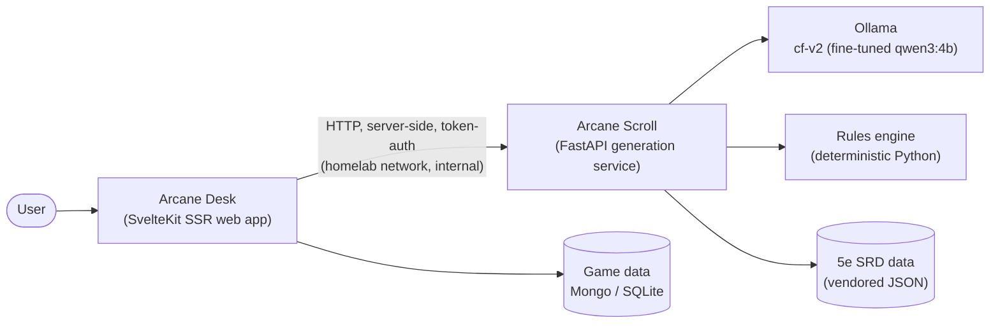
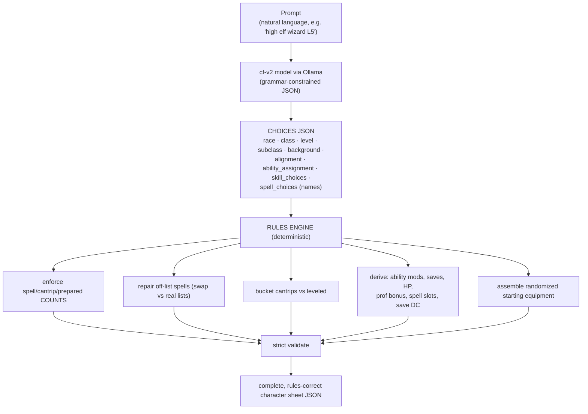

# Arcane Scroll — Project State & Knowledge Base

> **This is the master document.** It consolidates everything proven across the
> `character-forge` POC (June 2026) into one source of truth: what we're building, what
> works, what's decided, and what's next. The old per-session journal notes are archived in
> `character-forge/journal/historical/` — this file supersedes them.
>
> Last updated: **2026-06-26**.

---

## 1. Executive summary (read this first)

**What we're building.** Arcane Scroll is the **AI generation service** behind *Arcane Desk*
(the RPG web app). You give it a short prompt — *"a high elf wizard, level 5"* or just a name
and class — and it returns a **rules-correct D&D 5e character sheet as JSON**. Arcane Desk
calls it over HTTP and renders the result.

**The core architecture decision.** The AI system lives in its **own repo/service** (this one,
Python) separate from the web app (`arcane-desk`, SvelteKit). They communicate over a small
versioned HTTP API. Different runtimes, different hardware needs (this service is pinned to the
GPU box), different iteration speed — keeping them apart keeps both clean. The JSON schema is
the contract.

**How generation works (the one principle that drives everything):**
> **The model makes the *choices*; deterministic code does the *math*.**
The fine-tuned model picks race, class, background, alignment, ability assignment, skills, and
spell *names*. Code derives everything computable — modifiers, saves, HP, proficiency bonus,
spell slots, save DC, spell counts, cantrip/leveled bucketing, equipment. LLMs are unreliable
at arithmetic and counting; they're good at thematic choices. We split the work along that line.

**Where we are.** The hard parts are done and proven:
- ✅ A **fine-tuned `qwen3:4b` model** (`cf-v2`) that emits clean, schema-valid choices JSON,
  runs **100% on the 4 GB GPU at ~7 s**, and gets the *structure* right **~99%** of the time.
- ✅ A **strict validator** + vendored 5e rules data that objectively scores any output.
- ✅ A **2,000-pair gold dataset** (1,851 train / 149 held-out eval).
- ✅ Clear evidence for the two biggest design calls: **code owns the math**, and **RAG must
  *not* be bolted onto the fine-tuned model** (it makes it worse — see §5).

**What's left.** Build the **deterministic rules engine** (the "code does the math" half — it
turns the model's raw 50–60 % strict score into ~96 %), wrap it in a **FastAPI service**, and
wire **Arcane Desk** to consume it.

### Status at a glance

| Area | Status |
|---|---|
| Home-server platform (Docker/GPU/Ollama/Qdrant/NPM) | ✅ running |
| Model selection + fine-tune | ✅ done (`cf-v2`, q4_K_M) |
| Output contract / schema | ✅ locked (`CHOICES_SCHEMA`) |
| Strict validator + 5e data | ✅ working |
| Gold dataset (2,000 pairs) | ✅ done |
| **Rules engine (compute side)** | 🔧 **next — highest leverage** |
| FastAPI service (`arcane-scroll`) | 🔧 scaffolding now |
| Arcane Desk integration | ⬜ later |
| Backstory/flavour endpoint | ✅ proven (no-RAG, ~6 s); not yet built as a service |
| Off-disk backup of `/data` | ⬜ TODO (no backup yet) |

---

## 2. Architecture

### Two-repo split

- **Arcane Scroll** (this repo, Python): owns generation, the rules engine, the validator, the
  5e data, and the model definition. Pinned to the GPU box. Internal-only, behind Nginx Proxy
  Manager, token-protected.
- **Arcane Desk** (`arcane-desk`, SvelteKit): the product UI. Calls Arcane Scroll from its SSR
  layer so the API never needs public exposure.
- **Contract:** the character JSON schema is the single source of truth. Plan to generate TS
  types for Arcane Desk from it so the two stay in sync.

### Generation pipeline (character sheet)

**Key:** there is **no RAG in this path** (see §5 — RAG hurts the fine-tuned model). Keeping the
prompt small is also what keeps the 4B 100 % on the GPU (see §8 thermal note).

### Backstory path (separate, already proven)

Pure flavour → **no RAG, tiny context, ~6 s, 100 % GPU**. `qwen3:4b-instruct-2507`, temp ~1.0,
the sheet as context, a strong prompt with banned clichés. Produces varied, genre-true,
sheet-grounded ~150-word prose. Will become a second endpoint.

---

## 3. The platform (home server)

Dell Precision 5470 laptop turned home server. Full build notes archived in
`character-forge/journal/historical/`.

| | |
|---|---|
| Host / IP | `homeserver` / `192.168.0.16` (LAN, WiFi), user `sot` (sudo needs password) |
| OS / kernel | Ubuntu 24.04.4 LTS / 6.8.0 |
| CPU | i7-12800H — 6P + 8E cores, 20 threads |
| RAM | 30 GiB + 8 GiB swap |
| **GPU** | **NVIDIA RTX A1000 Laptop, 4 GB VRAM** ← the binding constraint |
| Storage | 1 TB NVMe; **`/data`** (~800 GB LVM) holds everything |
| Backup | ⚠️ **none yet** — TODO: restic/borg to an external drive (3-2-1) |

**Services** (Docker, on shared `homelab` network; compose files in `/data/stacks/<svc>/`):

| Service | Bind | Notes |
|---|---|---|
| **Ollama** | `127.0.0.1:11434` | `OLLAMA_FLASH_ATTENTION=1`, `OLLAMA_KV_CACHE_TYPE=q8_0`, `OLLAMA_KEEP_ALIVE=-1` |
| **Qdrant** | `127.0.0.1:6333` (REST), `:6334` (gRPC) | collection `srd_5e` (2,969 pts). **Not used by the character pipeline** (RAG dropped); kept for future non-character content. |
| **Nginx Proxy Manager** | `80/443/81` | only LAN-facing service; will reverse-proxy apps |

Docker bypasses `ufw` for published ports (fine on trusted LAN; revisit if ever exposed).

---

## 4. The model

**Decision: `qwen3:4b-instruct-2507`, fine-tuned.** It's the only model that both fits the 4 GB
GPU (→ fast, thermally immune) *and* follows the rules well enough. A 12-model comparison and a
correctness scorecard backed this (archived in `historical/`). The base 4B already nailed
non-casters; fine-tuning + the rules engine close the rest.

**Fine-tune (`cf-v2`)** — QLoRA via Unsloth on Kaggle (free T4/P100; we can't train a 4B on 4 GB
locally — cloud-train, local-infer):
- LoRA r=16, lr 2e-4, 3 epochs / 696 steps. Train loss **2.38 → 0.30**, held-out eval loss
  **0.448 → 0.337** (no overfitting).
- Dataset: the 2,000-pair gold set rendered as ChatML `user → assistant(JSON)`.
- Served via Ollama from a locally-converted GGUF (`finetune/v2/`).

**Quantization tradeoff** (full 149-prompt eval; "ceiling" = strict-valid once the rules engine
enforces spell counts, which is code's job):

| Quant | Size | GPU fit | Speed | Strict | **Ceiling** | Content errors |
|---|---|---|---|---|---|---|
| **q4_K_M** | 2.7 GB | **100 % GPU** | **~7 s** | 50.3 % | 90.6 % | 14 |
| q8_0 | 4.9 GB | 45/55 CPU/GPU | 7–22 s, heat-sensitive | 59.7 % | 96.0 % | 6 |

**Current choice: q4_K_M** for the speed and full-GPU residency (the original goal). q4 roughly
doubles *content* errors vs q8 (incl. occasional structural slips on race/ability) — acceptable
for v1, but **revisit q5_K_M** if quality matters more than the last few seconds. The model is
stable at q4 (0 parse failures / 0 loops across 149).

**How to rebuild the GGUF** (the reliable path we proved):
1. Train on Kaggle → download the **merged 16-bit** model (`cf_merged_16bit/`). *Don't* use
   Unsloth's own GGUF export — it mangled the chat special tokens.
2. Convert locally with **llama.cpp `convert_hf_to_gguf.py`** (`--outtype f16` or `q8_0`).
3. For q4: convert to f16, then `ollama create <name> --quantize q4_K_M -f Modelfile`.
4. Modelfile uses a **plain ChatML template, no `<think>` priming** (see §8).

---

## 5. What works — proven findings (with evidence)

1. **The fine-tune nails structure.** On 149 held-out prompts (no RAG, temp 0): **98.7 %
   structural accuracy** (race, class, subclass, level, ability assignment, background,
   alignment, skills, non-caster handling). 58 of 60 failures were *spell-only*.

2. **The model's only real weakness is spell *counts*, not spell *choices*.** Zero hallucinated
   spells across 149. The failures are almost all "picked N spells, class knows N±1" — i.e.
   **counting**, which is deterministic math. Enforce counts in code → **59.7 % → 96.0 %** (q8).
   This is the single highest-leverage piece of work left.

3. **🔑 RAG *hurts* the fine-tuned model.** Injecting per-class spell lists (which fixed the
   *base* model's hallucinations) made the fine-tune **worse**: on 10 caster prompts, strict
   2/10 → **0/10** and off-list/wrong-level spell errors 0 → **13**. Cause: the fine-tune was
   trained on *bare* prompts, so extra context is off-distribution and derails it (wrong-level
   picks, a paladin given cantrips, count explosions). **The fine-tune already internalised the
   spell lists.** → **No prompt-RAG in the character pipeline.** Fix spells with deterministic
   post-processing instead. (If we ever want RAG-grounded spells, we'd have to *train* with the
   context in-prompt, not bolt it on at inference.)

4. **Structured output guarantees shape, not correctness.** Ollama `format=<JSON Schema>` always
   returns schema-valid JSON, but the *content* (counts, math) still needs code. Proven in the
   earliest tests (valid JSON, wrong ability scores / empty equipment / wrong skill count).

5. **Backstory is solved** with the base 4B, no RAG, tiny context: ~6 s, 100 % GPU, varied and
   genre-true. No big model needed for flavour.

---

## 6. Design principles & locked decisions

1. **Code does the math, not the model.** Ability mods, saves (incl. the multiclass
   first-class rule), HP, proficiency bonus, spell slots, save DC, spell counts,
   cantrip/leveled bucketing, validation → all deterministic code.
2. **The model outputs CHOICES ONLY** (`CHOICES_SCHEMA`): `name, race, background, alignment,
   classes[{class, level, subclass?}], ability_assignment` (base standard array 15/14/13/12/10/8,
   *pre-racial*), `skill_choices`, `spell_choices{cantrips, spells}` (names). Everything else is
   derived. `equipment` is code-assembled (randomized starting package); advanced/magic items
   are a future loot/rewards endpoint. ASI/feats deferred for v1.
3. **No RAG in the character pipeline** (finding §5.3). Qdrant stays for possible future
   non-character content only.
4. **Two repos, one HTTP contract.** Arcane Scroll (Python AI) ↔ Arcane Desk (SvelteKit), schema
   as source of truth, internal API behind NPM with a shared token.
5. **Synchronous API for v1** — generation is ~7 s; add a job queue only if it gets slow/batchy.
6. **Cloud-train, local-infer** — fine-tune on Kaggle, run on the home GPU.

---

## 7. Data & code assets (to migrate into this repo)

Currently in the `character-forge` POC; the *good* parts move here, the throwaway POC scripts
stay behind.

| Asset | Location (POC) | Keep? |
|---|---|---|
| `CHOICES_SCHEMA` (canonical contract) | `character-forge/rules/schema.py` | ✅ migrate |
| Strict validator `validate_choices()` | `character-forge/rules/validate.py` | ✅ migrate |
| Vendored 5e rules data (1.2 MB JSON) | `character-forge/rules/data/` (from 5e-bits/5e-database, MIT/OGL) | ✅ migrate |
| Gold dataset (2,000 pairs) | `character-forge/dataset/gold/` (`all`/`train`/`eval`.jsonl) | ✅ keep (training asset) |
| Fine-tuned model (merged 16-bit + GGUFs + Modelfiles) | `character-forge/finetune/v2/` | ✅ keep |
| Kaggle fine-tune notebook + builder | `character-forge/dataset/gold/kaggle/` | ✅ keep |
| Eval harnesses (`eval_finetuned.py`, `eval_rag.py`) | `character-forge/poc/` | ✅ migrate (rename) |
| Rules engine (compute side) | — | 🔧 **build new, here** |

**Validator** (`validate_choices`) checks, as hard errors: race/alignment/background validity;
class/subclass (subclass only at unlock level); ability assignment == standard-array multiset;
skill count/on-list/no-dupes; spells real + on-class-list + correct level + exact counts
(prepared count from racial-adjusted ability mod); casters must have spells.

---

## 8. Hard-won gotchas (don't relearn these)

- **🔥 Thermal throttling is the real latency ceiling**, not the model. The chip heat-soaks to
  ~88–97 °C under sustained load (lid-closed airflow hurts). **Grammar-constrained decoding is
  thermally sensitive** — Ollama's per-token GBNF/sampling runs CPU-side, so a hot chip can swing
  the *same* generation from ~8 s to 96–181 s even at 100 % GPU. **Free-text (backstory) is
  immune** (~6 s always). Mitigations: keep prompts small (→ 100 % GPU), the rules engine (less
  grammar-constrained output), and cooling. Single generations are fine; sustained load throttles.
- **`<think>` preamble = the loop bug.** `tokenizer.apply_chat_template` for qwen3-2507 injects an
  empty `<think>\n\n</think>\n\n` block before the assistant target. Training on that taught a
  fragile preamble that **loops endlessly (`<tool_call>`/garbage) under llama.cpp/Ollama**. Fix:
  render training targets manually with **no `<think>` block**; the model then emits JSON directly
  and is stable even at q4. (v2 notebook already does this.)
- **q4 has a real quality cost** — ~2× content errors vs q8, including occasional core-field slips
  (race, ability). Not just a size knob.
- **qwen3 thinking models need `"think": false`** or the reasoning phase fights grammar-constrained
  JSON and returns empty content. (The 2507 *instruct* sidesteps this by being non-thinking.)
- **Unsloth's GGUF export mangled chat tokens** — always convert from the merged 16-bit with
  llama.cpp locally instead.
- **Cold start** ~30 s to load; `OLLAMA_KEEP_ALIVE=-1` keeps the model resident.

---

## 9. Roadmap / open items

**Now (highest leverage):**
1. **Build the rules engine** (`arcane-scroll`, Python) — the "code does the math" half:
   - enforce spell/cantrip/prepared **counts**; **bucket** cantrips vs leveled
   - **repair** off-list spells (swap against real class lists — rare but real)
   - derive ability mods, **saves** (multiclass rule), **HP**, proficiency bonus, **spell slots**,
     **save DC**
   - assemble a randomized **starting equipment** package
   - run the strict validator as a final gate
   - *Expected impact: q4 ~50 % → ~90 %+, q8 ~60 % → 96 % strict-valid.*
2. **Scaffold the FastAPI service**: `POST /v1/characters` → model → rules engine → validated JSON.
   Migrate `schema.py`, `validate.py`, `rules/data/`. Containerise on `homelab` behind NPM, token-auth.

**Next:**
3. **Wire Arcane Desk** to call the API server-side; generate TS types from the schema.
4. **Backstory endpoint** (`POST /v1/backstory`) — the proven no-RAG path.
5. **Resolve Arcane Desk's dual-DB smell** (auth on SQLite/Drizzle, content on Mongo) — consolidate.

**Later / watch:**
6. Re-evaluate **q5_K_M** if the q4 quality cost bites.
7. **Off-disk backup** of `/data`.
8. Loot/rewards endpoint (advanced/magic items) — reuses the service.
9. Cooling (pad/airflow/clean fans) for sustained throughput.

---

## 10. Pointers — where things live

- **This repo** (`/data/projects/arcane-scroll`) — the generation service (being scaffolded).
- **`/data/projects/arcane-desk`** — the SvelteKit web app (consumer).
- **`/data/projects/character-forge`** — the POC (being wound down). Assets to migrate in §7;
  archived notes in `journal/historical/`.
- **Home-server stacks** — `/data/stacks/{ollama,qdrant,npm}/`; app data in `/data/appdata/`.
