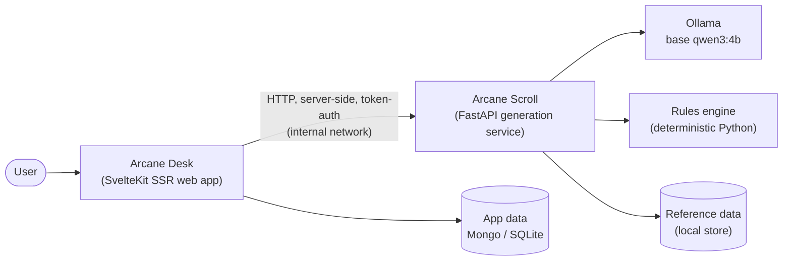
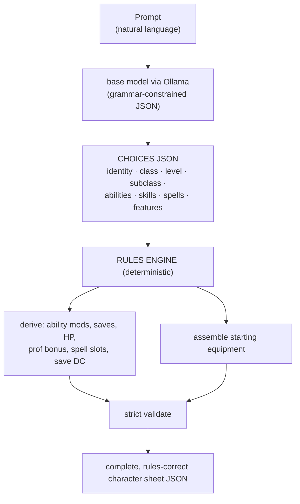

# Arcane Scroll — Project State

> **Master state doc (public, high-level).** One source of truth for what we're building, what
> works, what's decided, and what's next.
>
> Last updated: **2026-06-28**. **Major update:** dropped the fine-tune in favour of a **base
> model + per-request dynamic grammar** approach (§1, §4). Generation (sheet + all choices +
> flavour) is validated and essentially complete; the derivation engine + service are next.

---

## 1. Executive summary (read this first)

**What we're building.** Arcane Scroll is the **AI generation service** behind *Arcane Desk* (the
RPG web app). You give it a short prompt — *"a high elf wizard, level 5"* or just a name and a
class — and it returns a **rules-correct character sheet as JSON**, served over HTTP for Arcane
Desk to render.

**The core architecture decision.** The AI system lives in its **own repo/service** (Python),
separate from the web app (`arcane-desk`, SvelteKit), talking over a small versioned HTTP API.
Different runtimes, different hardware needs (this service is pinned to the GPU box), different
iteration speed — keeping them apart keeps both clean. The JSON schema is the contract.

**How generation works (the one principle that drives everything):**
> **The model makes the *choices*; deterministic code does the *math* — and validity is
> *engineered*, not hoped for.**
The model picks the thematic choices (background, alignment, skills, spell names, subclass when
unspecified, fighting style, expertise, and every subclass/class feature choice) plus the flavour
bundle. Code injects the deterministic fields (race, class, level, ability assignment, resolved
subclass) and — crucially — a **per-request dynamic grammar** constrains the model's picks to the
*valid* options at the *exact* counts. An engine de-dup/pad step fixes the one thing a grammar
can't (uniqueness). Result: **valid by construction**, with no reliance on the model knowing the
rules.

**The model approach changed (and got simpler — see §4).** We **dropped the fine-tune**. A **base
compact model (`qwen3:4b-instruct-2507`, q4_K_M) + dynamic grammar + engine de-dup** scores
**149/149 valid** on the held-out eval (single + multiclass, all levels) — beating the fine-tune's
ceiling *and* removing the two-model problem. **One** base model does both the sheet
(constrained JSON) and the flavour (plain prompt), fully GPU-resident (~2.5 GB).

**Where we are.** The generation half is essentially done and validated:
- ✅ **Sheet choices** — base model + dynamic grammar → **100% valid** over 149. Rich "taste"
  prompt locked: iconic, concept-fit picks at ~0 ms cost.
- ✅ **Class feature choices** — subclass (code-resolved, user-overridable), fighting style,
  expertise, and the **full spread of subclass/class feature options**, via a base + expanded
  **choice contract**.
- ✅ **Feats / advancement** — slots from class+level (multiclass-aware): the model picks feats,
  and code reserves an ability bump where one is due (by priority, capped correctly). Plus
  race-level choices.
- ✅ **Starting equipment** — per-class option slots → a route choice + a concrete-item pick.
- ✅ **Flavour bundle** — one structured call: bounded physical traits, personality, and a
  ~150-word backstory, with empty-field **archetypes** to break narrative monoculture. ~9–11 s/char.
- ✅ Strict **validator** + reference data; the rules layer is the shared source of truth.

**Generation (everything the model chooses) is now essentially complete and valid by construction.
What's left is derivation-side + the service:**
1. The **derivation engine** (the "code does the math" half) — ability mods + **final scores**,
   saves, HP, proficiency bonus, spell slots/DC/attack, AC, initiative, passive perception;
   **auto-granted subclass spells/features**; **languages & tool proficiencies**; **fixed-equipment
   packages**; assemble the chosen equipment into a concrete inventory; strict validator as the
   final gate.
2. Wrap it in a **FastAPI service** and wire **Arcane Desk**.

### Status at a glance

| Area | Status |
|---|---|
| Home-server platform (Docker/GPU/Ollama/Qdrant/NPM) | ✅ running |
| Model approach | ✅ **base `qwen3:4b` + dynamic grammar** (fine-tune dropped) |
| Output contract | ✅ per-request dynamic grammar |
| Sheet choices (incl. multiclass) | ✅ 100% valid (149/149) |
| Class feature choices (subclass/style/expertise/oddities) | ✅ done |
| Feats / advancement + race choices | ✅ done |
| Starting equipment choices | ✅ done |
| Flavour bundle (physical/traits/backstory) | ✅ done (one structured call) |
| Strict validator + reference data | ✅ working |
| **Generation (all model choices)** | ✅ **complete & valid by construction** |
| **Service stack (Docker: model + app)** | ✅ scaffolded — skeleton serving |
| **Shared resource catalog (load-time)** | ✅ loaded in memory at startup |
| **Character sheet generator** | ✅ base contract + feature/feat/equipment choices |
| **Backstory generator** | ✅ physical + personality + backstory |
| **HTTP API** (`POST /v1/characters`, `/v1/backstory`) | ✅ live — `/v1/characters` now returns choices **+ derived sheet** |
| **Test suite** (per-layer, synthetic fixtures) | ✅ 175 passing |
| **Derivation engine (compute side)** | ✅ render-ready sheet + armour-based AC + inventory assembly + **starting treasure**; two-pass next (T42/T46) |
| Arcane Desk integration | ⬜ later |
| Off-disk backup | ⬜ TODO |

### Changelog (newest first)

- **Smart ASI allocation (T48)** — `ability_scores` no longer dumps a flat +2 on one ability. It counts the available ASI points (2 per ASI slot; a slot spent on a real feat yields none) and places them to maximise modifiers (a point only buys a modifier when it takes an odd score to even): the primary ability is raised toward 20 through odd steps but never left stranded on a no-modifier odd, then remaining points even out the highest-priority odd abilities. The ability a model *names* on an ASI pick is now ignored (placement is optimal; the original split-ASI grammar change is unnecessary). Live: primaries land even/at-20 (Str 16→18, etc.), no wasted odd→odd jumps. +3 tests (175); a lone leftover ASI point is spent in full on the highest-priority ability (ASIs come in pairs).
- **Review cleanups (T51)** — F2: `_repair_invocations` takes its count from the granted level (`_invocations_n`), not the model's current list length (removes order-coupling). S1: `sheet.generate` threads the already-computed `ability_assignment` into `helpers.repair` (no recompute). PRF-3: `proficiencies` normalises `tools` to names. VIT-1: documented the `classes[0]`=level-1 convention in `max_hp`. **equipped_armour** now matches by *exact item name against the assembled inventory* — retiring the substring / name-subset / shield word-boundary heuristics (and `_carried_text`); the engine assembles the inventory once and AC reads it. GEN-4 (bare-dict response typing) deferred (low ROI). Net −2 tests (172).
- **Catalog-driven unarmoured defence (T49)** — `vitals.armor_class` reads an `unarmoured_defence` table (`{barbarian: con, monk: wis}`) instead of hard-coded class-name strings, so a renamed/localised class index no longer silently disables it. Behaviour unchanged (Barbarian +CON, Monk +WIS); `armor_class` now takes `cat`.
- **Style↔weapon coherence on every slot + shield rule (T55)** — extended the equipment-grammar style filter from the fighter/paladin union slot to **every weapon-bearing route**, including concrete enum slots (rogue/barbarian) and styles granted by a *secondary* class. Routes whose weapons carry an excluded property are dropped, category-pick enums are filtered, and weapon counts are gated by max (all routes) / min (union picks only — a per-slot single-weapon route isn't dropped); all with a no-empty fallback. Added an **always-on rule**: a route granting a shield never offers a two-handed weapon (kills greatsword+shield). Melee styles now also exclude ranged. Live: rogue/ranger TWF → two melee (was Rapier+Shortbow); shield route 0 two-handed leaks; Defense left weapon-agnostic. +3 tests (174).
- **Code-side variety spread (T57; closes T45, T53)** — background and fighting style are now pre-picked in code (seeded random) and injected as **fixed fields**, instead of model choices that monopolised (Soldier/Acolyte, Dueling/Two-Weapon). Precedence: explicit request input (and the future decoder, T58) → random spread → fallback. The model can't pick or override them. Live: fighters now spread ~7 backgrounds / all 5 styles over 12 (was ~1-3 / one dominant style). Follows the T56 spike finding (variety in code, coherence in prompt). +4 tests (171).
- **Per-class prepared/known spell tagging (T50)** — `spellbook` tagged every leveled spell with a single character-wide prepared flag, so a prepared+known multiclass mislabelled the known caster's spells (and vice-versa). A leveled spell is now prepared iff it sits on one of the character's *prepared-caster* class lists (per-spell, from the spell records' class lists), else known. Single-class unchanged. +1 test (167).
- **Multiclass spell slots (T43)** — `spell_slots` now uses the RAW **combined caster level** (full +level, half-casters Paladin/Ranger +level//2) looked up in a full caster's slot table, instead of summing each class's slots. Paladin 6 / Sorcerer 2 → `{1:4, 2:3, 3:2}` (was `{1:7, 2:2}`); single-class casters unchanged and half-casters reproduce exactly. Warlock is excluded from the combined level and its Pact Magic reported in a new separate **`pact_slots`** field. Driven by a `caster_progression` table (local data). Now generic over any number of caster classes incl. third-caster subclasses (EK/AT, level//3, subclass threaded into the slot math). +3 tests (166).
- **Two-pass equipment + style-enforced coherence (T46, completes T42)** — equipment is now a SECOND generation pass: pass 1 builds the sheet minus equipment; pass 2 picks gear, prompted with the built character. The pass-2 grammar is **constrained to the chosen fighting style** at build time — a one-weapon style (Dueling/Protection/Defense) only offers the weapon-and-shield route and excludes two-handed weapons; Two-Weapon offers only the two-weapon route; Archery ranged-only; Great-Weapon two-handed-melee-only — so an incoherent pick is impossible by construction (filters fall back to the full options if they'd empty a slot). A spike first confirmed the GBNF converter enforces the union; the measured style↔weapon route mismatch went ~20% → **0/20**. Pass 2 is skipped when taking gold instead of equipment. +6 tests (163).
- **Starting treasure (T42 Phase B)** — `derive` now yields `treasure: {gp}`. Default = the background's starting gold. A request flag `roll_starting_wealth` takes the RAW gold-instead-of-equipment path: the equipment grammar is omitted (choices carry no equipment), inventory is empty and AC falls back to unarmoured, and treasure = rolled class `starting_wealth` (dice × x) + background gold (seeded `rng` → reproducible). +6 tests (157). T42 remaining: T46 two-pass selection.
- **Equipment relation + inventory assembly** (T47 + T42 Phase A) — a seed-built `class_equipment` relation normalises each class's starting equipment (fixed package + per-slot alternatives, each with its concrete items + category pick). The grammar now models a category slot as a **discriminated union**: `equipment_<i> = {route, weapons}`, where the chosen route fixes exactly how many category picks it carries — so the model emits the right count and there is no over-collected `_pick` to trim (verified by a spike: Ollama's GBNF converter enforces the `oneOf`+`const`+per-branch length cleanly). `derivation.equipment.assemble_inventory` resolves the chosen routes/picks into `inventory: [{item, quantity}]` on the sheet. The phantom-companion bug (E1) is now structurally impossible. +4 tests (151).
- **Code-review fix batch** (PRs #17–#20) — a multi-agent review of the whole codebase (tech debt, smells, bugs), then fixes split into four file-disjoint PRs:
  - **#17 race canonicalisation** — race was validated case-insensitively but stored verbatim, so a legal `"human"` silently got generic body bounds + default skin in the backstory; `parse` now resolves to the canonical display name and flavour lookups are casing-tolerant. Documented the `_norm`/`_ci` split; removed dead `caster_classes`.
  - **#18 I/O + HTTP hardening** — model/network failures and unparseable model output now raise a typed `ModelError` → **502** (were opaque 500s); catalog load failures wrap as a clear `RuntimeError`; `/ready` never throws; `/backstory` validates race/class; `prompt()` rejects active-but-empty text. Added `client.py` tests (was untested).
  - **#19 repair completeness + shield** — repair now synthesizes feature/equipment fields the model omits (truncation); shield detection matches a whole word (`"a shielded lantern"` no longer grants +2 AC).
  - **#20 derivation guards** — `derive` rejects empty classes; vitals/proficiency tolerate unknown class indices; medium armour caps Dex at +2 even without `max_bonus`; an unparseable ASI redirects to the primary instead of vanishing; unknown spell names are dropped not mis-bucketed at level 1.
  - Follow-ups filed as cards: T48 (split +1/+1 ASI), T49 (catalog-driven unarmoured defence), T50 (per-class prepared tagging), T51 (minor cleanups); the phantom-companion (E1) folded into T42. +19 tests (147).

- **Armour-based AC** (PR #16) — AC now uses the *equipped* armour instead of always unarmoured. New `derivation/equipment.equipped_armour` finds the worn armour + shield from the chosen equipment routes/picks **and** the fixed class package; `vitals.armor_class` computes base + capped Dex (light=full, medium=+2, heavy=none) + shield, falling back to unarmoured (incl. Barbarian/Monk). Fixes the glaring case — a plate paladin read AC 9, now 18. +5 tests (128); the name-subset trap (Half Plate ⊂ Plate) is fixed and regression-tested. First slice of T42; inventory assembly, treasure, and two-pass equipment selection follow.
- **Ability requirements** (PR #15) — `ability_assignment` now combines all classes (level-weighted
  rank-sum) **+ a subclass priority override**, so a multiclass (e.g. fighter/wizard) gets a sensible
  array instead of just the primary class's (Int no longer dumped). **Multiclass legality** enforced
  in `request.parse`: 13+ in each class's key ability, **400** when more than three abilities would
  need it (impossible under the standard array, e.g. Monk/Paladin). And feat eligibility gained
  **ability-score + armour-proficiency prerequisites** (checked against the pre-call base+racial
  scores), completing the engineered feat gate from PR #14. Data (local): multiclass prereqs, subclass
  priority overrides, feat prereq attributes. +6 tests (120).
- **Feat/option eligibility — capability-based ban** (PR #14) — engineered cross-field consistency,
  pre-call. A character's capabilities (`caster`/`martial`) = union over its classes **and** subclasses
  (multiclass + gish covered for free — caster subclasses grant `caster`, the martial bard subclass
  grants `martial`). Feats declare a required capability (`feat_attributes`, local data): caster-only
  feats are banned from non-casters and weapon/martial feats from non-martials before the model sees
  the grammar. Invocations are filtered by level pre-call; a post-call repair (`repair_features`)
  drops any whose pact / Eldritch-Blast prerequisite the chosen build doesn't meet and re-pads from
  eligible ones. +6 tests (114). Single-class blade-pact warlock is intentionally not pre-covered
  (the pact is model-chosen); multiclass is the path for that gish.
- **Versioned prompts** (PR #13) — system prompts moved from bare catalog strings into a versioned
  `prompts` records table (locator + version + active flag + comment + text). `Catalog.prompt(locator)`
  returns the active version; superseded versions are kept for history with a comment on why. Both
  generators read through the resolver. Tuned content (local data): the sheet prompt gained build-synergy
  rules (feat fits role, fighting style matches weapons, background fits concept) and the flavour prompt
  a consistency guard. +2 tests (108 total). _Note: the 4B model follows these on average but doesn't
  guarantee cross-field coherence — engineered choice-repair would be the robust path._
- **Subrace resolver tweaks** (PR #12) — two small derivation fixes so subraces resolve fully:
  `vitals.speed` now prefers a subrace's own `speed` (e.g. Wood Elf 35) over the parent's, and
  `features._race_traits` reads `racial_traits` on subrace records (their forward `traits` is empty)
  in addition to the parent's `traits`. +1 test (106 total).
- **Derivation fields — render-ready sheet** (PR #11) — filled the gaps against the field-inventory
  reference. `proficiency.py`: armour/weapon/tool proficiencies, **languages** (Common + race + a
  random race-option pick + the background's "choose N" from the new language table), and skill
  `source` + background-granted skills. `spellcasting.py`: **spell slots** by level + the full
  spellbook **bucketed** by level (prepared vs known), including subclass/feature-granted spells
  (third-caster subclasses, bonus/racial cantrips, bardic secrets). New `features.py`: class features
  (level tables) + race/subrace traits + background feature. Scaffold/meta: `schema_version`, `xp`,
  `death_saves`. **Data:** added the standard background records (13) and the language list (16) to
  the **local** DB (only local data carries values; the repo stays content-neutral). +13 tests (105 total).
  Still parked (data-blocked): equipment assembly, treasure/starting wealth, armour AC.
- **Derivation refactor — split by concern** (PR #10) — behaviour-preserving: the monolithic
  `engine.py` is now a thin `derive()` orchestrator over per-concern modules — `abilities.py`,
  `vitals.py`, `proficiency.py`, `spellcasting.py` — so the follow-up sheet fields land in their
  natural home rather than growing one file. Tests reorganised one-file-per-module; 92 passing.
- **Derivation engine** (PR #9) — new compute-only layer `app/derivation/` that turns the (repaired)
  choices into a full sheet: proficiency bonus, ability scores (base array + racial + ASIs, capped 20,
  with the reserved-ASI rule), modifiers, max HP + hit dice, saving throws, the skill table (with
  expertise doubling), passive perception, initiative, speed, and spell save DC / attack. Pure named
  helpers over `(catalog, scores, …)`. `POST /v1/characters` now returns `{choices, sheet}`. +19 tests
  (90 total), incl. multiclass HP/saves/prof-bonus/multi-caster, passive perception, and negative
  modifiers. Deferred by data/scope: armour AC from equipped items (no item-stat records → unarmoured
  base, incl. Barbarian/Monk unarmoured defence) and feat mechanical effects (only ASI bumps applied).
- **Additive choices: features + feats/ASI + equipment** (PR #8) — the expanded contract on top of
  the base sheet, in two new modules. `app/generation/features.py`: each choice is a `{field, enum, n}`
  descriptor gated by `(class, subclass, level)` + race — fighting style, expertise, and the subclass
  oddities (metamagic, invocations, maneuvers, totems, ancestry, third-caster spells school-filtered,
  favoured enemy/terrain, …), plus character-level feats/ASI and race options. `equipment.py`: the
  primary class's starting-equipment slots become route enums + category "companion" enums. Both are
  pure + catalog-driven (value lists by neutral key, gating/counts in code); single-pick → string,
  multi-pick → array. The sheet generator merges all of it into the per-request grammar and fits it in
  repair (expertise narrowed to chosen skills; equipment companions may repeat). +26 tests (71 total).
- **Backstory generator** (PR #7) — a second generation module (`backstory.py`, same shape as the
  sheet generator over shared helpers): one structured model call produces race-bounded physical
  traits, personality (two traits + ideal/bond/flaw), and a ~150-word backstory grounded in the
  sheet. Empty-uniqueness requests get a random seed angle (archetype) to keep backstories varied;
  physical bounds are clamped server-side. Exposed as **POST /v1/backstory**; verified end-to-end.
  Test coverage filled out across **both** generators (45 total) — incl. prepared-caster counts,
  multiclass spell pools, spell repair, the sheet orchestrator, patron-expansion, and skin overrides.
- **Test suite** (PR #6) — per-layer / per-service tests (catalog, generation helpers, request,
  sheet generator, controller) against a small **synthetic** catalog fixture — content-free and
  runnable anywhere; the controller test mocks the model. 27 tests (pytest); dev deps in
  `requirements-dev.txt`.
- **Character sheet generator** (PR #5) — a **generation layer** with one module per generator over
  shared pure helpers (`helpers.py`). The **character sheet** generator (`sheet.py`) translates a
  request → catalog-driven grammar + prompt → model → repaired, valid-by-construction choices,
  exposed via a thin controller — **POST /v1/characters**, with a typed, OpenAPI-documented request
  model (`/docs`). Base contract (deterministic fields + skills + spells); verified over HTTP across
  minimal / multiclass / high-level / subclass-override cases and the error paths (400 / 422). The **backstory** generator (its own module + helpers, same
  shape), feature/feat/equipment choices, bounds-clamping, and the derivation engine are next.
- **Shared resource catalog** (PR #4) — the reference store now loads into memory once at startup as
  a single generic resource module: entity *records* by kind + supplemental *lists* by name,
  addressed by neutral key. It's the shared source the grammar builder / validator / derivation read
  from — no per-request DB access, and the module itself is data-free. Loads the full store
  (hundreds of records + dozens of lists).
- **Docker stack scaffolded** (PR #3) — self-contained compose: a model server + the app, plus the
  reference data mounted at runtime. The app loads the catalog into memory at startup and exposes
  `/health` + `/ready`; the catalog is built from the mounted data on boot; the model is ensured
  idempotently. Brought up live and verified — model resident on GPU, ~38 tok/s decode (no
  regression vs. the previous setup), runtime settings intact. *(Infra + skeleton only; no data in
  the repo.)*
- **Public docs** (PR #2) — README, sanitized project state, and license.

---

## 2. Architecture

### Two-repo split

- **Arcane Scroll** (this repo, Python): owns generation, the rules engine, the validator, and the
  model definition. Pinned to the GPU box. Internal-only, behind Nginx Proxy Manager,
  token-protected.
- **Arcane Desk** (`arcane-desk`, SvelteKit): the product UI. Calls Arcane Scroll from its SSR
  layer so the API never needs public exposure.
- **Contract:** the character JSON schema is the single source of truth. Plan to generate TS types
  for Arcane Desk from it so the two stay in sync.

### Generation pipeline (character sheet)

**Key:** there is **no RAG in this path** (see §5). Keeping the prompt small is also what keeps the
4B model 100 % on the GPU (see §8 thermal note).

### Backstory path (separate, already proven)

Pure flavour → **no RAG, tiny context, fast, 100 % GPU**. Base `qwen3:4b-instruct-2507`, higher
temperature, the sheet as context, a strong prompt. Produces varied, genre-true, sheet-grounded
~150-word prose. A second endpoint.

---

## 3. The platform (home server)

A Dell Precision 5470 laptop repurposed as a home server.

| | |
|---|---|
| Host | on the internal LAN (private address); standard sudo user |
| OS / kernel | Ubuntu 24.04.4 LTS / 6.8.0 |
| CPU | i7-12800H — 6P + 8E cores, 20 threads |
| RAM | 30 GiB + 8 GiB swap |
| **GPU** | **NVIDIA RTX A1000 Laptop, 4 GB VRAM** ← the binding constraint |
| Storage | 1 TB NVMe; a large data volume holds everything |
| Backup | ⚠️ **none yet** — TODO: restic/borg to an external drive (3-2-1) |

**Services** (Docker, on a shared internal network):

| Service | Notes |
|---|---|
| **Ollama** | `OLLAMA_FLASH_ATTENTION=1`, `OLLAMA_KV_CACHE_TYPE=q8_0`, `OLLAMA_KEEP_ALIVE=-1` |
| **Qdrant** | a vector collection; **not used by the character pipeline** (RAG dropped); kept for possible future non-character content |
| **Nginx Proxy Manager** | the only LAN-facing service; reverse-proxies apps |

---

## 4. The model

> **⚠️ Superseded (2026-06-28) — current path: NO fine-tune.** The model is now the **base
> `qwen3:4b-instruct-2507` (q4_K_M) + per-request dynamic grammar + engine de-dup** → **149/149
> valid**, one model for sheet *and* flavour, fully GPU-resident (~2.5 GB). Why: validity is
> *engineered* by the grammar (the model is constrained to valid options at exact counts), so the
> model no longer needs to memorise rules — the base model + grammar **beats the fine-tune's
> ceiling** and removes the two-model problem. The sheet uses **raw `/api/generate` + manual
> ChatML** (the 2507 chat parser 500s on grammar-fenced JSON). The fine-tune notes below are
> **historical** — kept for the lessons (training pitfalls, quant tradeoffs), not the path.

**[Historical] Decision: `qwen3:4b-instruct-2507`, fine-tuned.** It was the only model that both
fit the 4 GB GPU (→ fast, thermally immune) *and* followed the rules well enough. A 12-model
comparison and a correctness scorecard backed this. The base 4B already nailed non-casters.

**Fine-tune** — QLoRA via Unsloth on Kaggle (free T4/P100; can't train a 4B on 4 GB locally —
cloud-train, local-infer):
- LoRA r=16, lr 2e-4, 3 epochs / 696 steps. Train loss **2.38 → 0.30**, held-out eval loss
  **0.448 → 0.337** (no overfitting).
- Dataset: a 2,000-pair gold set rendered as ChatML `user → assistant(JSON)`.

**Quantization tradeoff** (full 149-prompt eval; "ceiling" = valid once the rules engine enforces
counts, which is code's job):

| Quant | Size | GPU fit | Speed | Strict | **Ceiling** |
|---|---|---|---|---|---|
| **q4_K_M** | 2.7 GB | **100 % GPU** | **~7 s** | 50.3 % | 90.6 % |
| q8_0 | 4.9 GB | 45/55 CPU/GPU | 7–22 s, heat-sensitive | 59.7 % | 96.0 % |

**Current choice: q4_K_M** for the speed and full-GPU residency. q4 roughly doubles *content*
errors vs q8 — acceptable for v1, but **revisit q5_K_M** if quality matters more than the last few
seconds. Stable at q4 (0 parse failures / 0 loops across 149).

**How to rebuild the GGUF** (the reliable path):
1. Train on Kaggle → download the **merged 16-bit** model. *Don't* use Unsloth's GGUF export — it
   mangled the chat special tokens.
2. Convert locally with **llama.cpp `convert_hf_to_gguf.py`**.
3. For q4: convert to f16, then `ollama create … --quantize q4_K_M`.
4. Use a **plain ChatML template, no `<think>` priming** (see §8).

*(Note: the fine-tune is no longer on the critical path — the base model + grammar supersedes it.)*

---

## 5. What works — proven findings (with evidence)

1. **Structure was never the hard part.** On 149 held-out prompts (temp 0): **98.7 % structural
   accuracy**. Almost all failures were *choice-count* related, not structural.

2. **The model's only real weakness was *counts*, not *choices*.** Zero hallucinated picks across
   149. Failures were "picked N, should be N±1" — i.e. **counting**, which is deterministic math.
   Enforcing counts in code took the score to **96 %**. This is exactly why the dynamic grammar
   (which fixes counts *by construction*) was the winning move.

3. **🔑 RAG *hurt* the fine-tuned model.** Injecting reference lists (which fixed the *base*
   model's hallucinations) made the *fine-tune* worse — extra context was off-distribution and
   derailed it. → **No prompt-RAG in the character pipeline.** Fix correctness with deterministic
   post-processing (and, now, with constrained decoding) instead.

4. **Structured output guarantees shape, not correctness.** A JSON-schema-constrained response is
   always schema-valid, but the *content* (counts, math) still needs code. → the grammar handles
   shape + valid options; code handles the maths.

5. **Backstory is solved** with the base 4B, no RAG, tiny context: fast, 100 % GPU, varied and
   genre-true. No big model needed for flavour.

---

## 6. Design principles & locked decisions

1. **Code does the math, not the model.** Ability mods, saves (incl. the multiclass first-class
   rule), HP, proficiency bonus, spell slots, save DC, counts, validation → all deterministic code.
2. **The model outputs CHOICES ONLY**, constrained by a **per-request dynamic grammar**, not a
   static schema. *Base contract:* identity + skills + spells + fighting-style/expertise when
   granted. Code injects race, ability assignment (standard array, pre-racial), classes (with the
   **code-resolved subclass** — hybrid: user value else random, before the call). *Expanded
   contract:* per-`(class, subclass, level, race)` enums for **feature choices, feats/advancement,
   race choices, and starting equipment**. Everything computable is **derived**. All model-side
   choices are implemented and valid by construction.
3. **No RAG in the character pipeline** (finding §5.3).
4. **Two repos, one HTTP contract.** Arcane Scroll (Python AI) ↔ Arcane Desk (SvelteKit), schema
   as source of truth, internal API behind NPM with a shared token.
5. **Synchronous API for v1** — generation is a few seconds; add a job queue only if needed.
6. **Cloud-train, local-infer** (relevant only if we revisit fine-tuning).

---

## 7. Hard-won gotchas (don't relearn these)

- **🔥 Thermal throttling is the real latency ceiling**, not the model. The chip heat-soaks under
  sustained load (lid-closed airflow hurts). **Grammar-constrained decoding is thermally
  sensitive** — per-token sampling runs CPU-side, so a hot chip can swing the *same* generation
  from ~8 s to well over a minute even at 100 % GPU. **Free-text (backstory) is immune.**
  Mitigations: keep prompts small (→ 100 % GPU) and improve cooling. Single generations are fine;
  sustained load throttles.
- **`<think>` preamble = a loop bug.** The 2507 chat template injects an empty `<think>` block
  before the assistant target; training on that taught a fragile preamble that loops endlessly
  under llama.cpp/Ollama. Fix: render targets manually with **no `<think>` block**.
- **q4 has a real quality cost** — ~2× content errors vs q8. Not just a size knob.
- **Thinking models need `"think": false`** or the reasoning phase fights constrained JSON and
  returns empty content. (The 2507 *instruct* sidesteps this by being non-thinking.)
- **Cold start** ~30 s to load; `OLLAMA_KEEP_ALIVE=-1` keeps the model resident.

---

## 8. Roadmap / open items

**Done:**
- ✅ **Service stack scaffolded** (Docker: model + app, self-contained; app skeleton serving) — see Changelog.

**Now (highest leverage):**
1. **Generator** (base contract) is in — catalog-driven grammar/prompt → model → repaired choices.
   Next on it: the additive **feature / feat / equipment** choice helpers, then a port of the strict
   **validator** as a final gate.
2. **Build the derivation engine** — the "code does the math" half, on top of the now-valid
   choices: ability mods, **saves** (multiclass rule), **HP**, proficiency bonus, **spell slots /
   save DC / attack**, AC, initiative, passive perception; **auto-granted subclass spells/features**;
   **languages & tool proficiencies**; **fixed-equipment packages**; assemble the chosen equipment
   into an inventory; the strict validator as the final gate. *(Choice validity is already solved by
   the grammar — this layer adds the computed sheet.)*
3. **Generation + flavour endpoints** on the scaffolded service: prompt → grammar-constrained
   generate → derivation engine → validated JSON; plus a flavour endpoint.

**Next:**
4. **Wire Arcane Desk** to call the API server-side; generate TS types from the schema.
5. **Resolve Arcane Desk's dual-DB smell** (auth + content stores) — consolidate.

**Later / watch:**
6. Re-evaluate **q5_K_M** if the q4 quality cost bites.
7. **Off-disk backup.**
8. Cooling for sustained throughput.
